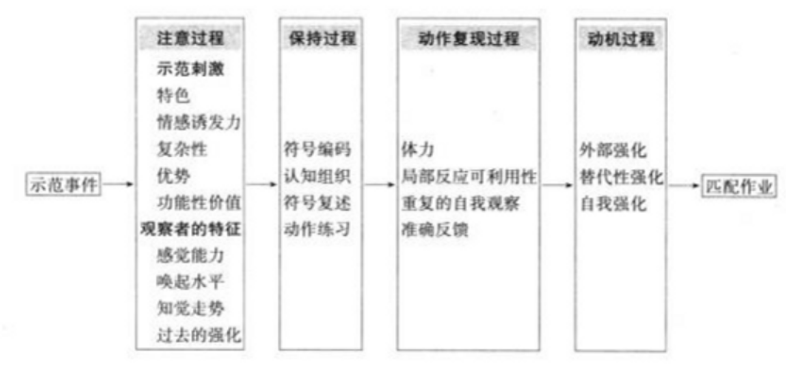

## 一、经典精神分析理论

精神分析(psychoanalysis) 是 19 世纪末 20 世纪初产生， 在奥地利发展起来的一个重要的心理学派别。它不是从传统的心理学理论发展而来，而是在医疗实践中创立的一种独特的理论，在目的、对象和方法上都有其独到之处。至今，精神分析的学术思想仍然是心理学理论体系中最重要的部分之一。

精神分析理论的创始人西格蒙德。弗洛伊德(SigemundFreud，1856一1939)，毕业于维也纳大学医学院，获得医学博士学位。在心理学的年鉴上，全怕没有哪位人物会像弗洛伊德这样备受吹捧而又惨遭诈毁，他既被认为是伟大的科学家、学派领袖，又被斥责为搞假科学的骗子。但他的崇拜者和批评者都一致认为他对心理学的影响、对心理治疗的影响、对西方人看待自己的方式的影响，比科学史上的任何人都要大得多

1885 年弗洛伊德师从于法国著名的神经病学家夏柯，1886 年回国后作为私人医生在维也纳开业。他在长期的医疗实践中创建了“宣泄”、“自由联想"、“释梦”等治疗方法，并不断完善了一套精神分析的理论体系。

### (一) 潜意识理论

弗洛伊德提出的潜意识理论是精神分析理论的基石。他把人的心理分为潜意识、前意识和意识三个部分。

1. 潜意识”潜意识(unconscious) 有两层含义： 一是指人们对自己的一些行为的真正原因和动机不能意识到； 二是指人们在清醒的意识下面还有一个潜在进行着的心理活动。潜意识的内容中包含了那些为人类社会、伦理道德、宗教所不容许的、原始的、目无法纪的动物性本能冲动，以及幼年期的经验、被压抑的欲望和动机等。正常人的大部分心理活动是在潜意识里进行的，大部分的日常行为是受潜意识驱动的，它是人类心理活动的原动力所在，遵循的是享乐原则，不顾及社会的道德规范、法律等的约束。因此，潜意识活动的内容、观念、欲望如果要进入意识，就要受到社会标准的检验而被拒绝，但是如果不进人意识，就得不到满足。为了使这些被压抑的观念和欲望能够出现在意识中，得到满足，就只能乔装打扮，变相出现而获得间接的满足。梦就是一种满足这种愿望的形式。

2. 前意识”前意识(preconscious) 是介于意识与潜意识间的心理活动，它是曾经属于意识的观念思想，因与目前的实际关系不大或无关，被逐出意识的园地，但可以较快地、较容易地疾人到意识领域。洪意识的观念首先进入前意识才能到达意识界。前意识的作用就是保持对欲望的需求和控制，使其尽可能按照外界现实规范的要求和个人道德来调节，是意识和潜意识之间的缓冲。

3. 意识 意识(conscious) 指人能知觉到的东西，是人当前注意到的心理活动、感知外界的各种刺激，是与语言(即符号系统》 有关的部分心理活动。意识活动是遵循现实原则来行事的，也就是说只有合乎社会规范和道德标准的各种观念才能进入意识界。

被压抑在最深处、最底层的潜意识是最活跃、最不安分的分子，它们千方百计地想表现出来，但申于社会礼教、风俗习惯、伦理道德等社会标准的作用，意识作为最高统治者发挥着它的威力，控制着潜意识使其留在最底层， 不允许其表现和满足。弗洛伊德认为，人的心理活动中有一种保持意识层面不受干扰、不受潜意识侵犯的压抑作用，强迫那些潜意识的冲动留在原处，并一次又一次地打回或项回企图来犯的潜意识。

### (二) 人格结构理论

弗洛伊德将人格结构分为本我、自我和超我。当三者关系协调，人格则表现出健康状况： 当三者关系冲突，就会产生心理疾病。

1. 本我 本我(id) 是与生俱来的动物式的活动，相当于潜意识内容，它服务于快乐原则 (principleofpleasure)，它不看条件、不问时机、不计后果地寻求本能欲望的即时满足和紧张的立即释放。本我中的需求产生时，个体要求立即满足，从而支配人的行为。比如，婴儿感到饥饿时立即要求史奶，绝不考虑母亲有无困难。弗治伊德称本我中的基本需求为“生之本能"，它的成分是人类的基本需求，比如摄食、饮水、性等这些基本生理需要。生之本能是促进个体求生活动的内在力量，这种内在力量被称为“力必多”(libido) 。本我内除了由基本需要形成的生之本能之外，也包括攻击与破坏两种原始性的冲动，这种冲动称“死之本能"。弗洛伊德分别以希腊神话中爱神的名字爱洛斯(Eros) 代表生之本能， 以死神的名字萨那托斯(Thanatos) 代表死之本能。

2. 自我 自我(ego) 是现实化的本能，它是个体出生后在现实环境中由本我中分化发展而产生的，代表着理性和审慎，由本我而来的各种需求，如不能在现实中立即获得满足，就必须迁就现实的限制，并学习如何在现实中获得需求满足因此，自我服从于现实的原则 (principleofreality)，配合现实和超我的要求，延迟转移或缓慢释放本我的能量对本我的欲望给予适当的满足。

3. 超我 超我 (superego) 是道德化了的自我，它是长期社会生活过程中，将社会规范、道德观念等内化的结果，类似于人们通常讲的良心、理性等，为人格的最高形式和最文明的部分，多属于意识。超我中有两个重要的组成部分： 一个是自我理想 (ego-ideal)，是要求自己的行为符合自己理想的标准，当个体的所作所为符合自己的理想标准时，就会感到骄傲； 另一个是良心 (conscience)，是规定自己不犯错误的标准，如果自己的所作所为违反了自己的良心，就会感到愧次。超我服从于至善原则 (principleofperfecb)，它一方面负责对违反道德标准的行为施行悉罚，另一方在确定道德行为标准。

本我在于体现自我的生存，追求本能和欲望的满足，是必要的原动力。超我在于监督、控制和约束自己的行为，不至于违反社会道德标准，以维持正常的人际关系和社会秩序。而自我对上要符合超我的要求，对下要吸取本我的力量，并处理、调整本我的欲望，对外要适应现实环境，对内要保持心理平衡。如果一个人的本我、自我、超我三者彼此交互调节、和谐运作，就会形成一个发展正常、适应良好的人；如果三者调节失衡，或者彼此长期冲突，往往就会导致个体社会适应困难，甚至演变成心理异常。

### (三) 焦虑及自我防得机制理论

在人格发展过程中，本我、自我、超我之间产生冲突时，个体就可能产生焦虚。弗洛伊德描述了三种类型的焦虚： 现实性焦虑、神经性焦虑和道德性焦虚。 例如一个歹徒追赶我们，引起的是现实性焦虚，因为丽惧来自外部世界。相反，神经性焦虑和道德性焦虑是由个体内部的威胁造成的，当个体担心不能控制自己的情感或本能而作出将会引来权威者息罚的事情时，神经性焦虚就会出现，当个体担心会违反父母或社会的标准时，道德性焦虑就会出现。焦虑使自我感受到危险的通近，这时自我就要采取行动。

为了使自我能够应对焦虚，这时就需要防御机制。 无论是健康人、神经症或者精神病病人，都在无意识地运用心理防御机制。当自我心理防御机制启用适当时，它们帮助我们减少压力，增强适应能力。但是，如果被过多地使用，这种使用就成了病态的，而个体也就发展出一种回避现实的风格。自我心理防御机制最初是由弗洛伊德本人提出，之后安娜对它们进行了系统的归纳和整理，后来的心理学家们又对心理防御机制进行了补充和修改，下面介绍十种常见的自我心理防御机制：

1. 压抑 (repression》 是一种最基本的防御机制，也是其他防物机制的基础。压抑将那些危险的或令人痛苦的想法和感受排除在知觉范围之外。它常常是焦虑的来源。在人生前五年中发生的心理创伤性事件一般会被压抑为无意识。而被压抑的冲动和欲望并未消失，它仍在无意识中积极活动，寻求满足。

2. 否认(denial) 和理认现实也许是所有自我防御机制中最简单的一个，它让人们有意识或无意识地拒绝使人感到焦虑痛苦的事件。 例如，拒绝承认亲人的死亡。

3. 反向形成 《reactionformation) 人们通过采取与令人不安的欲望相反的有意识的态度和行为，从而避免自己去面对无法接受的冲动，使自己无需去应对本应出现的焦虑。这种表现可能是个体会用虚假的爱来隐藏自己的恨。例如，一个恨丈夫的妻子，可能在行动上过分地爱和献身于丈夫，以此来避免因不喜欢丈夫而导致的对婚姻的威胁。

4. 投射 (projection) 即把自己产生的无法接受的情感或意念归因于他人。当个体感受到强烈的性驱力、破坏驱力或道德律令的威助时，他可能不会容忍相应的焦虚，而是把自己的情感投射到他人身上。 我们其实也经常这么做，因此我们常常困惑不已，为什么别人的行为和我们那么相似。

5. 置换 displacement) 当个体感到焦虑时，他可能不把自己的冲动、情感发泄到危险的物或人身上，而把它转移到更安全的物或人身上。例如，在公司受了老板责骂的老实人，回家可能把愤怒转嫁到自己孩子身上。

6. 升华 (sublimation) 是一种较为积极的防御机制。它把内驱力改造成社会可接受的行为。例如，最常见的形式就是把攻击性的欲望转化为体育竞技。体育运动为身体攻击性的表达提供了一个更被接受的发澄氏道，力比多与攻击驱力经常在不被个体觉知或意识到的情况下得以表达出来，并且还可能得到额外的奖励一一称赞。

7. 合理化《(rationalization) 某个已经发生面不被个体所接受的精粒的、失败的行为或观念，人们就找出看似合理正当的理由来解释它，从而缓解自己的焦虑和失望感。例如，伊索寅言里吃不上葡萄的狐狸说葡萄是酸的。

8. 退行 (regression) 是指倒退到一个早期的人格发展阶段。面对强大的压力、焦虑时,个体可能会采取过去适宜,但是现在已经不成熟的行为。例如，成年人在内心焦虑时可能不自觉地咬手指等。

9. 认同 (identification) 通过呈现出他人的特征，人们可以减少自己的焦卡及其他消极情感。例如认同一位成功的企业家、运动员等。人们能通过认同成功的因素来提升自己在他人眼中的价值，从而提高个体的自尊感，并使个体摆脱失败感。认同是发展过程的一部分，儿童可以通过认同习得性别角色的行为，同时它也可能成为过度自卑者的防御反应。

10. 理智化《(intellectualizarion) 不直接应对情感的问题，而采用抽象思维间接地处理。例如，某人被公司降职了， 但他却儿似超然地说事情本来可能会更粳。

### (四) 性心理发展阶段理论

弗洛伊德把性作为潜意识的核心问题，他认为潜意识中被压抑的欲望可归结为人的性和欲串动，人的性本能是一切本能中最基本的东西，是人的行为的唯一重要动机。他把这种本能的能量称之为“力比多”(libido)，力比多是驱使人追求快感的一个潜力。人成长的不同时期,“力比多”附着的部位是不一样的。按照这个理论，人的心理发展被分为以下五个时期：

1. 口导期 (oralstage，0-1 岁) 这一时期要儿原始欲望的满足，主要是靠口腔部位的吸史、咀嚼、吞咽等活动来完成的。婴儿的快乐也多来自口腔的活动。如果这一时期口腔的活动受到限制，就会给将来的生活带来不良影响。成年人中有些人被称为“口腔性格者"，可能就是口唇期发展不顺利导致的，他们在行为上主要表现为贫吃、醒酒、吸烟、咬指甲等，甚至有些性格的表现，如自卑、依赖及洁癖等也被认为是口腔性格的特征。

2. 肛门期 (analstage，1-3 岁) 这一时期原始欲力的满足主要靠排泄和控制大小便时所产生的刺激快感而获得满足。这个时期是对机幼儿进行卫生习惯训练的关键时期。如果管制得过严，也会给将来的生活带来不良影响。成年人中有些人表现出冷酷、顽固、刚乙自用、音亩等，被弗洛伊德称为“肛门性格"，可能就是这一时期发展不顺利的结果。

3. 性器期 (phallicstage，3-6 岁) ”这一时期原始欲力的满足主要集中于性器官的部位。此时，幼儿辫欢触摸自己的性右官，幼儿在这个时期已经可以辨别男女性别，并且以父母中的异性作为自己的“性爱”对象，于是男孩以自己父亲为竞争对手而恋爱自己的母亲，这种现象被称为恋母情结 (oedipuscomplex) 。同理，女孩以自己的母亲为竞争对手而恋爱自己的父亲的现象被称为恋父情结 (electracomplex) 。按弗洛伊德的说法，当男童发现女童的性器官与自己不同时，他可能假想甚至怀疑是被他父亲制掉了。因而产生恐惧，弗洛伊德称这种现象为图割丽惧(fearofcastration) 或赔割情结 (castrationcom-plex) 。像这种既恋爱母亲又长惧父亲的男童心理冲突，以后会自行逐渐消失，从原来的敌对转变为以父亲为楷模，向他学习、看齐，这种现象被称为认同。类似的心理历程也会在女童身上发生。由于她发现自己的性器官与男性不同，她怀疑自己原来的性器官被别人割掉了，于是既恋爱父亲却也对男性心怀钱妒，这现象被弗洛伊德称为阳具钱妒 (penisenvy)，并认为女性这种情结直到成年结婚生子才会真正得到化解。

4. 潜伏期(latency，6 岁到 12-13 岁) ”6一7 岁以后的儿童兴趣扩大,注意力由对自己的身体和父母的感情转变到周围的事物，因此原始的欲力呈现出潜伏状态。这一时期的男女儿童之问，在情感上比以前疏远，团体活动多时男女分离的趋势。

5. 两性期 (genitalstage，青春期以后) 青春期的开始时间，男性一般在 13 岁左右，女性一般在 12 岁左右。此时，个体的性器官逐新成熟，生理与心理上所显示的特征，使两性差异开始显著。在这个时期以后，性的需求转向相似年龄的异性，并且有了两性生活的理想，有了婚姻家庭的意识。至此，性心理的发展已趋于成熟。

根据弗洛伊德的精神分析理论，每个人在早期发展阶段中都会出现问题，因为冲突和固着是不可和避免的，不适宜行为是普遍和必然的。而异常症状不仅取决于冲突和固着首先发生的那个心理性欲阶段，还取决于在这一阶段中为了应付随冲突而起的焦虑所采用的防御机制。焦虚的程度由自我、本我和超我的斗争决定。长期的警觉和防御使自我的力量训退，而允许力比多退行到早年的固着点，导致孩子气、自恋或者道德败坏等。在极端情况下还可能失去控制本我的能力，导致精神病的产生。

精神分析治疗通常会采用自由联想、解释、释梦、移情分析、阻抗分析等技术，帮助人们把无意识中的内容变为意识，让他们深刻领悟痛苦的原因，并鼓励来访者把新的领悟用于日常生活体验中。精神分析理论用于心理咨询与治疗的目标是，@将无意识的内容带进意识； @@增强自我的力量，使个体的行为更立足于现实，而不是受本能的驱使或非理性内疯的影响。

精神分析是产生于医疗实践并始终和医疗实践密切联系的心理学思想，它在精神病学和医学心理学领域作出了历史性贡献。有人认为弗洛伊德是生物-心理-社会医学模式的先驱，他为后来心身医学的发展作出了一定的贡献。精神分析的研究成果已为社会学、人类学、医学、法学等领域广泛应用。

## 二、行为主义心理学

行为主义心理学于 20 世纪初期诞生在美国，它彻底放弃了传统心理学主张研究意识等主观性概念，认为所有行为都是外部环境因素引起的，主张研究可观察的行为。依据其历史发展脉络，本节主要从经典性条件反射理论、操作性条件反射理论、社会学习理论三个领域来介绍行为主义理论。

### (一) 经典性条件反射

在 20 世纪初，俄国生理学家伊万。巴甫洛夫(IvanPetrovich，1849一1936》 在研究狗的消化作用时发现了条件反射。他的条件反射学说被公认为是发现人和动物学习各种行为的最基本的生理机制理论。

1. 基本实验

    巴甫洛夫及其助手把狗用一副套具固定住，并用一个连接在狗栋外侧的管道来收集狗的唾液，管道再连接到一个装置上，该装置既可以测最狗腺体分泌唾液的总量，也可以记录分洲唾液的滴数(图 2-1) 。

    巴甫洛夫和他的助手把各种可食用和不可食用的东西放入给狗眼食的容器里，在放人和不放和食物的同时，结合相应的铃声、丢步声观察不同情况下狗分刻唾液的情况。在实验中，他发现给狗叶现喂食的容器也能够引起狗分泌唾液； 或是狗听到铃声和眼狗人的脚步声同样会分泌唾液等。

2. 理论观点

    (1) 在上述实验条件下，狗的唾液分刻称为“反射"，即是一种对特定刺激自动发生的反应，不需要意识控制或学习。对人来说,唾液分论也是一种纯粹的反射。假如你饿了了，看到面前有诱人的食物,你就会有唾液分洲。

    (2) 在实验中，狗把一些不是食物的“信号刺激”和食物联系起来，并且作出唾液分说的反应。由此，巴前洛夫认为存在丙种类型的反射即条件反射 (conditionedreflex) 和无条件反射 (uncondirionedreflex) 。其中无条件反射指有机体生来固有的对保存生命有重要意义的反射，例如食物吃到中里引起唾液分洲的生理反应，此时的食物就是无条件刺激，引起的分说唾液反应就是无条件反射； 而条件反射是通过在有机体大脑皮质上建立起暂时神经联系来实现的，是有机体在无条件反射基础上后天习得的反射，例如研究助手的脚步声本来不会引起狗分说唾液，但是当脚步声和食物多次配对、重复后，狗听到脚步声(或铃声) 就会分泌唾液，脚步声 (或铃声) 就成为条件刺激，而引起的分泌唾液反应就成为条件反射。

    (3) 在实验中，中性刺激和无条件刺激的多次重复出现研究中，巴甫洛夫提出了强化和消退、泛化和分化概念，这些概念在行为心理治疗中是非常重要的。

    强化 (reinforcement) 和消退： 条件刺激与无条件刺激在时间上的结合称为强化，强化的次数越多，条件反射就越巩固。然而，当条件刺激不被无条件刺激所强化时，就会出现条件反射的消退。例如，对以铃声为条件刺激而形成唾液分泌条件反射的狗，只给铃声而不用食物强化，多次以后，铃声引起的唾液分泌量将逐渐减少，甚至完全不能引起分说，即出现了条件反射的消退情况。

    泛化(generalization) 和分化(discrimination)： 泛化指的是在条件反射形成初期，除条件刺激本身外，那些与该刺激相似的刺激也或多或少具有条件刺激的效应，引起条件反射。例如，狗形成了对三声铃声的条件反射 (分泌唾液) 后，就会对一声或两声作出反应，新刺激与原来的条件刺激越类似，泛化的现象越容易发生。与泛化互补的是分化过程，是指对事物的差别反应。例如，通过选择性强化或者消退会使得狗只对三声铃声作出反应。

    (4) 人类的许多复杂行为，仅有条件反射是形成不了的，也就是说，有机体可以在已有的条件反射的基础上建立更新的、更复杂的条件反射。巴甫洛夫条件反射学说可以解释和说明人类的许多行为，人们的日常生活极其复杂，但人可以随机应变，这主要在于人由于条件反射的存在而处于一种半自动化的状态，节省了很多资源来应付其他的事情。但是,条件反射也会带来一些负面作用，例如恺惧症是从何而来，为何焦虑和不安，你为何不喜欢某种食物，什么是你情绪的来源，这些问题在咨询和治疗中可以使用条件刺激给以清除和击退。

### (二) 华生的恐惧实验及其理论观点

行为理论的另一代表人物华生 (JohnBroadusWatson，1878一1958) 指出，情绪反应是我们对环境中某种特定刺激的条件反射，也就是说，人的情绪反应是习得的。他相信所有人类行为都是学习和条件反射的产物，正如他在 1913 年的著名研究报告中宣称的“给我 12 名健全的贾儿和我可用以培育他们的特殊世界，我就可以保证，对随机选出的任何一名婴儿，我都可以把他训练成为我所选定的任何类型的特殊人物，如医生、律师、艺术家、商界领袖、人乞丐或小偷等.”

1. 基本实验”实验的被试是一名 9 个月大的心理和生理健康的孤儿艾尔波特，为了解艾尔波特是否害怕某种特定刺激，实验者做了周密的实验。首先选用了一些不引起恺惧的东西作为中性刺激，然后用锤子贡击铁棒，发现巨大的声音会引起他的害怕和哭泣，作为无条件刺激。如图 2-2 所示。

实验开始时，研究者向艾尔波特同时呈现白鼠和令人恺惧的声音，一开始，艾尔波特对白鼠很感兴趣并试图触摸它。在他正要伸手时，突然辣响铁棒，突如其来的响声使艾尔波特十分惊恶，这一过程重复了 3 次。一周后，重复同样的过程。在白鼠和声音的配对呈现7 次以后，不出现声音，单独向艾尔波特呈现白鼠时，艾尔波特对白鼠产生了极度丽惧，大刁并转身背对白鼠，飞快地疏离开白鼠。整个过程，对于一种物体从没有恐惧到产生疏惧只有短短的一周时间。

2. 理论观点

(1) 华生在这个实验研究中得出人类的所有行为都是源于学习和条件反射的，同时证实人们的行为来自无意识这一论断是错误的，并把其研究推论到其他情绪中，如愤怒、愉快、伤心、惊讶或厌恶等。同时，华生的研究被很多关注仆惧症产生原因和治疗方法的最新研究所采用。

(2) 在这个实验中，华生还提到,一个弗洛伊德主义者会把吸晚拇指当作追求快乐的本能表现。然而，华生却认为，假如艾尔波特在他感到恺恨时吸哆拇指，并且拇指一放到嘴里就感到不害怕了，这种吸唤拇指的行为是一种阻碍念惧产生的条件反射。

(3) 华生及其助手后来又想到艾尔波特会不会对其他类似的白色物体发生丽惧反应，于是又做了相关的实验，研究证实了这一狂想，由此就再次验证了对肪惧的泛化问题。华生等人做的恺惧实验，原计划在后期要给小艾尔波特矫正以消除他的恺惧行为，但由于艾尔波特转院而没有做成。该实验留给我们一笔巨大的财富一一情绪行为可以通过简单的刺激-反应手段成为条件反应，但是它也严重违反了伦理道德。

华生式行为主义心理学的影响在 20 世纪 20 年代达到最高峰。它的一些基本观点和研究方法渗透到很多人文科学中去，从而出现了“行为科学”的名称。直至今天，其涉及的领域仍十分广泛。华生的环境决定论观点影响美国心理学达 30 年，他的预测和控制行为的观点促进了应用心理学的发展。

华生过分简化的刺激-反应公式不能解释行为的最显著特点，即选择性和适应性。30年代以后，行为主义的后继者在操作主义的指引下试图克服这一致命缺点，从而形成多种形式的新行为主义。

### (三) 操作性条件反射

操作性条件反射理论体系形成于 20 世纪 30 年代以后，在心理治疗中，贡献较为突出、体系较为完整的是斯金纳(BurrhusFrederickSkinner，1904一1990) 的操作性条件反射(工具性条件反射) 。

1. 基本实验

    30 年代后期，斯金纳为研究操作性条件反射精心设计制作了一种特殊的仪器，即斯金纳箱 (Skinnerbox) (图 2-3)。

    

    
图 2-3 斯金纳箱

    斯金纳箱是动物学习实验的自动记录装置。它是一个长宽高大约为 0. 3m 的箱子，内有杠杆和与食物储存器相连接的食物盘。斯金纳早期都是用白鼠做实验，在箱内的白鼠按压杠杆，就有一粒食物深人食物盘，便获得食物。一只饥猴的白鼠进入箱内，开始时有点胆丑，经过反复探索，会作出按压杠杆的动作，就会有食物进入。随着实验过程的进展，白鼠为了获得食物还会表现出有意的不断按压杠杆，就会形成雏鼠按压杠杆取得食物的条件反射。如果需要的话，实验者能通过控制食物的发放而强化某种特定的行为。

2. 理论观点

    (1) 斯金纳的理论用一句简单的话来说就是： 在任何特定的情境下，你的行为都很可能伴随着某种结果，比如得到赞扬、报酬或解决问题后的满足感，那么今后在类似的情况下，你很可能重复这一行为，这些结果被称为“强化"。如果你的行为伴随着另一种结果，比如疼痛或道人熔，那么今后在相似的情况下，你将很少会再重复这一行为，这些结果被称为“惩罚"。强化和御罚是斯金纳的操作性条件反射的两个基本过程。如图 2-4 所示。强化-学习

    

    
图 2-4 操作性条件反射两个基本过程

    (2) 强化(reinforcement) 是指在强化物的作用下，行为的加强。强化有正性强化和负性强化，它们都会增加这种行为在将来出现的可能性。正性强化《(positivereinforcement) 指一个行为的发生，随着这个行为出现了刺激的增加或刺激强度的增加，导致了行为的增强；负性强化(negativereinforcement) 指一个行为的发生，随着这个行为出现了刺激的消除或者刺激强度的降低，导致了行为的增强。

    慧甸(punishment) 是指在一个行为发生之后立刻跟随一个令人厌恶的刺激或撤除一个正强化物，从而抑制这个行为的再次发生。巧罚同强化一样有正性惩罚和负性惩罚，它们都会减少某种行为将来出现的可能性。正性息罚指一个行为发生后跟随一个令人厌恶的刺激物，并出现了一个令人不愉快的结果，导致将来这个行为不太可能再次发生； 负性惩罚指一个行为发生后撤走一个正强化物，减少将来这个行为再次发生的可能性，

    (3) 关于操作性条件反射的消退，斯金纳认为： “如果在一个已经通过条件化而增强的操作性活动发生之后没有强化刺激物出现，它的力量就前弱.”可见，与条件作用的形成一样，消退的关键也在于强化。 例如，白鼠的压杆行为如果不予以强化，压杆反应便停止； 学生某一良好反应未能受到教师充分的关注和表扬，学生最终放弃作出良好反应的努力。 而且，斯金纳强调反应的消退表现为一个过程，即一个已经习得的行为并不即刻随强化的停止而终止，而是继续反应一段时间，最终趋于消失。在实际治疗中，只要治疗者对期望的某种行为子以奖励，这种行为就会获得强化，反之就会消退。若施加惩罚，就会加快消退的速度。

    (4) 斯金纳认为行为矫正，正是通过积极的强化来改变行为的一种手段。斯金纳不承认有心理疾病一说，他认为任何不好的行为都是强化所致，于是也不存在传统心理学所认为的内因论。例如，有人把神经症和行为失调归结为机体生理上的原因，而他认为这是惩罚过分的结果或者是控制不当引起的。任何个体和个体、团体和团体之间都有一种控制关系，控制是应当的，但是也往往会出现控制不当的行为。此外，斯金纳特别指出负强化物在行为矫正中扮演的作用以及息罚在行为矫正中的使用。总之，行为矫正的本质是通过积极的强化来改变人类的行为。

### (四) 社会学习理论

巴章洛夫的条件反射学说和斯金纳的操作性条件反射学说等都忽视了行为的内部过程和学习过程中的认知因素。班杜拉的社会学习理论是在米勒和多拉德的社会学习论的基础上发展而来的。他在 1969 年明确指出“所有来源于直接经验的学习现象都可通过观察他人的行为及其所体验到的结果，在普代的基础上发生”，进而提出了观察学习(observa-tionallearning) 的概念。班杜拉及其助手设计出了著名而又有影响力的“波比娃娃”儿童模仿攻击行为实验，了阐述了社会学习理论的相关观点。

1. 基本实验 “波比娃娃”实验的研究者让儿童分别观察两名成人，一名表现出攻击性行为，另一名不表现出攻击行为。无论是在攻击情境还是在非攻击情境中，榜样一开始都先装配拼图玩具。1 分钟后，攻击性榜样便开始用暴力击打波比娃娃，例如坐在它的身上、反复击打它的鼻子、击打它的头部，并伴随有攻击性语言等，对于所有的攻击条件下的被坛，接受到的榜样行为程序是一样的，持续近 10 分钟。另一组是在无攻击行为情境中，榜样只是认真地玩 10 分钟拼图玩具，完全不理会波比娃娃。在这两种情境下观察儿童的行为习得情况，得出一些相关的结果。

班杜拉使用类似“波比娃娃研究”的实验方法,考察了电视或其他非人类的攻击榜样对被坛的影响力，并且研究了在特定的条件下榜样的暴力影响可以被改变。给儿童看成人攻击性行为的电影，让儿童看到不同的奖励或息昼，接下来，就让儿童进入一问游戏室，里面放有一个同样的充气人以及这个成人榜样使用过的其他物体，观察儿童的行为反应。

结果发现，真人榜样影响力最大，其次就是看到榜样受奖励的那一组儿童，比看到榜样受息罚的另一组儿童，表现出更多的攻击性行为。

2. 理论观点”班杜拉的研究从很大程度上说明了儿童的新行为是怎样通过简单地模仿成人而习得的，其至成人可以并不真正出现。社会学习理论家认为，构成一个人的许多行为，都是通过模仿形成的。另外，班杜拉关于榜样暴力行为的研究为学校减少暴力作出了一定的贡献。

从实验研究中，班杜拉总结出了观察学习以及观察学习过程，观察学习是指通过观察示范者的行为而习得行为的过程，班杜拉将它称之为“通过示范所进行的学习"，即间接经验的学习。班杜拉所关心并研究的正是这种行为的习得过程。班杜拉认为，人们一旦有了这样的学习能力，就可以很快学习到很多内容，并可以掌握那些带有一定危险性、不可人能或不易通过多次尝试错误的直接经验去获得的行为模式。观察学习也称为榜样学习，学习中的他人即榜样。

班杜拉认为观察学习不要求必须有强化，也不一定产生外显行为，班杜拉把观察学习分为以下四个过程(图 2-5)。

图2-5 班杜拉的观察学习流程图

(1) 注意过程 (attentionprocesses) ： 在此阶段，观察者注意和觉知榜样情景的各个方面。榜样和观察者的几个特征决定了观察学习的程度： 观察者比较容易观察那些与他们自身相似的或者被认为是优秀的榜样： 有依赖性的、自身概念低的或焦虑的观察者更容易产生模仿行为。

(2) 保持过程(retentionprocesses)： 班杜拉以信息加工的方式描述观察学习的心理过程，即借助于选择性注意记住他们从榜样情景了解的行为，所观察的行为在记忆中以符号的形式表征，并使用表象和言语来保持信息，即个体贮存他们所看到的感觉表象，并且使用言语编码记住这些信息。

(3) 行为再造过程(reproductionprocesses) ：前两个阶段是信息由外向内，而行为再造过程也称为复制过程、动作复现过程，是信息由内向外，是将符号化表征转化为适当的行为。此时要求个体： 四选择和组织反应要素； 加在信息反馈的基础上精炼自己的反应，即进行自我观察和矫正反馈。

(4) 动机过程(motivationalprocesses)： 经过了注意选择、保持和再造三个过程后,完成了观察学习的习得过程，而动机过程就由学习者来掌握了，人们并不一定要表现他们所学习的一切东西。行为的个人标准、习得的行为本身对于损作行为也具有很重要的意义。

示范的影响和观察学习的范围非常广泛，从儿童的行为模仿到社会实践活动的传播,从家庭内的观察到社会力至全世界的流行趋势，均是观察学习的内容和范围。

在行为疗法的技术体系中，有一些治疗技术是依据社会学习理论发展出来的，例如示范疗法、行为排演等。榜样学习原理还更善遍地应用于心理咨询过程中，或者被其他专门技术所结合和吸收使用。

## 三、人本主义心理学

人本主义心理学于 20 世纪 60 年代初在美国兴起，人本主义理论被称为心理学的“第：势力"，它既反对作为“第一势力”的精神分析的生物还原论，又反对作为“第二势力”的行为主义的机械决定论，主张研究人的本性、潜能、经验、价值、生命意义、创造力和自我实现。其代表人物主要有马斯洛、罗杰斯等。

人本主义心理学对人性持乐观的看法，认为人类本性是善良的，而且，人类的本性中萄藏着无限的潜力。因此，人本主义心理学的研究，不仅是了解人性，而且更进一步，主张改善环境以利于人性的充分发展，从而达到自我实现 (self-actualization) 的境界。

人本主义心理学在美国得到了迅速发展。1962 年，马斯洛和罗杰斯等几位人本主义心理学家组建了人本主义心理学会，该会规定的几项工作原则是： 首要研究对象是具有经验的人； 四研究经过选择的人，关心的是个人的创造性和自我实现； 回研究对个人和社会有意义的问题；! @@人的尊严和价值的提高应成为心理学的主要涉及范围。人本主义心理学的研究成果在实际生活中得到广泛应用，此理论鼓励和指导人们成为精神健全和富有创造性的人，在治疗心理疾患和培养健全人格方面起了积极的作用，并促成了开发健康人潜能的热潮。其主要代表性理论有：

### (一) 马斯洛的自我实现心理学

亚伯拉罕。马斯洛 (AbrahamMaslow，1908一1970) 是人本主义心理学最有影响力的人物之一。他从人类动机入手对人的需要、本性等进行了探讨，提出了其理论观点。

1. 需要层次理论 ”马斯洛认为，动机是人类生存和发展的内在动力，而需要是动机产生的基础和源泉。人的需要是按层次排列的。 层次越低的需要就越同动物的需要相似，就越基本，力量越强大，层次越高的需要，就越是人类特有的需要，但力量越微弱。

马斯洛将需要分为五个层次。个体只有满足了低一级的需要，才会有动力促使高一级需要的产生和发展。生理需要是最低级、最某本，也是最强有力的需要。当某一个体生理需要 (如饥饿、渴、性) 得到满足后，他就要开始寻求安全需要 (如避免自然、意外的危险、职业的稳定) 的满足。当安全需要被满足后，个体开始寻求归属与爱的需要 (如爱人及被爱，被团体认同和接受) 的满足。当归属与受的需要被满足后，他又开始寻求尊重需要 (如自尊、自重和为他人所驹重) 的满足。当尊重需要被满足后，他就要涉及自我实现的需要。自我实现是人类最高层次的需要。因为每个人都充分发挥他的全部潜能是不可能的，马斯洛也把那些高层次性需要已得到充分满足的人看作自我实现的人。

在上述五个层次的需要中，生理需要和安全需要有一段温长的进化史，因而具有强大的力量；而爱、尊重和自我实现是人类特有的高级的需要，这些需要与生存没有直接关系，但它们的满足能引发更深刻的幸福体验，达到精神安宁和内心的充实，因而更值得追求。

2. 自我实现理论 ”自我实现理论是人本主义心理学的核心。库尔特。艾尔欧坦首先将自我实现(selfactualization) 这一概念引入心理学，最初指个体寻求并且能够获得健康的发展，这将导致对自己的完整表达。马斯洛进一步发展了这一观点，认为自我实现的需要是人对于自我潜能发挥和完成的欲望，是一种使个人潜力得以实现的倾向。这种倾向使一个人越来越成为独特的那个人，成为他所能够成为的一切。对此他曾这样说： “作曲家必须作曲，画家必须画画，诗人必须写诗，如果他想最终与自我处于和平状态的话.”

马斯洛理论中的“自我实现”这个概念是指个体在成长中，其身心各方面的潜能获得充分发展的过程和结果，也就是说，个体本身生而具有但是潜藏未露的良好品质得以在现实生活环境中充分展现出来。它包括两层含义：完满人性的实现和个人潜能的实现。其标准，一是人的实质和潜能现实化，二是没有或极少出现不健康、精神疾患和基本能力欠缺。自我实现有两种类型： 其一，健康型自我实现，即更务实、更能干的自我实现者； 其二，超越型自我实现，即更经常意识到内在价值、生活在存在水平或目的水平而具有丰富超越体验的人。

马斯洛还对希望能成为自我实现的人提出了7 条建议，OD把自己的感情出口放宽， 要有宽广的心胸； 四在任何情境中都尝试从积极乐观的角度看问题，从长远的利益作决定；图对生活环境中的一切要多欣赏、少抱急，有不如意的地方，设法改善；! 图设定积极而又可行性的生活目标，然后全力以赴去实现自己的目标，但是也绝对不能期望未来的结果一定不会失败；加对是非的争辩，只要自己认清真理正义之所在，就算违反多数人的意愿也应该挺身而出，站在正义的一方，坚持到底； 人@@不要使自己的生活僵化，要为自己在思想上和行动上留一些弹性空间，偶尔放松一下身心，将有助于自己潜力的发挥； 四与人坦素相处，让别人看见你的长处与缺点，也让别人分享你的快乐与痛苦。

### (二) 罗杰斯的人格自我心理学

卡尔"罗杰斯(CarlRogers，1902一1987) 生于芝加哥，成长于家教严格、刻板保守的家庭，获得了临床和教育心理学硕士学位。1972 年成为美国历史上第一个被心理学会授予杰出专业贡献奖和杰出科学贡献奖的心理学家。其基本理论如下：

1. 人性论 
    
    罗杰斯同弗洛伊德一样，也是从对问题人群的临床实践开始了对人性的探索。但与行为主义和精神分析的人性观相比，罗杰斯眼中的人性更为积极和具有建设性。

    罗杰斯人性观点的集中体现是实现倾向这一概念。罗杰斯强调人们有彰着健康方向成长和前进，并将其能力发展到极致的固有倾向。这种实现倾向是指： 人类发展他们的所有潜能，变成他们遗传属性将允许其成为的最好的样子的先天倾向。在他看来，从出生开始， 个体就要向着自我实现苗壮成长。我们基本都是向上、积极的，具有建设性和创造性的，当环境支持人成长时，人们就具有一种成功的倾向。如果给予适当的条件，每个人身上正常的成长和发展能力就会得到释放。因此，治疗师的主要任务是提供一种安全和信任的氛围，提供适当的条件，从而促使来访者重新整合其自我实现和自我评价过程。

    罗杰斯也相信人格中具有消极面，但他认为这不是天生的而是后天获得的，是对被知觉为具有危险和威胁的环境的一种防御反应。对环境的积极反应可以消除防御，而对环境的消极反应，就会导致不适宜的行为。

2. 自我论 
    
    自我或自我概念理论是罗杰斯心理学中很重要的一部分。自我概念 (self-concept) 是指一种习得的关于一个人的能力和个性的知觉的集合。自我概念最初由大量自我经验、体验堆砌面成，通过在各种与重要他人的交互作用情境中，开始区分主格的“我 (D"”、宾格的“我 (me)”及“我自己 (self)”，这些经验形成自我概念。通俗来讲，刚出生的婴儿，除了一般意义上的认识，不知道自己是唯一的独立的实体。当他们生长发育及父母和其他重要人物影响他们时，每个孩子才渐渐意识到有一种“他”的东西,孩子开始说“我想要……”“我想……”“把那个东西给我”等。当自我和自我概念发展时，实现倾向的作用是使生物体的这个新生部分实现，罗杰斯称这个为自我实现倾向，可以视为实现倾向的一个子系统。如果个体能和自己的个体评估过程(自己真实的喜好和感受) 保持联系，那么自我实现过程将会继续顺利发展。如果能从重要他人(如父母、喜欢的老师) 那里获得无条件积极关注，那么这种情况就很可能发生。但是，这种理想的无条件积极关注的环境或家庭是非常少的，大多数人都是成长于有条件地被爱而不是无条件地被爱的环境中。当个体面对与自我结构不一致的经验时，就会觉得受到威胁，体验到焦虚，个体有选择地知觉经验或乍曲经验。为了维持重要他人的爱和保护,儿童学会乍曲他们知觉到的自我。例如性行为是不对的、男人哭泣或相互拥抱是不合适的、女人不应该独立等被重要他人赞成的思想、情感、行为，可能与个体自己认可的经验不一致，导致形成几乎彻底的分裂。这种不健康的发展最初导致焦虚，最后使人们陷人不适宜行为。

3. 以人为中心的心理治疗论 

    罗杰斯的理论经历了三个发展阶段； 非指导性治疗、当事人中心治疗到以人为中心治疗。形成了一种以积极角度看待个体，相信个体会向功能充分实现的方向发展的心理治疗理论。

    以人为中心治疗，尊重来访者的人格尊严。 心理治疗的目标不仅是帮助来访者解决问题，更在于帮助来访者的个人成长，从而使他们成为充分发挥作用的人，能更好地解决他们目前以及将来面临的问题。吸引他人、若骗自己及扭曲知觉等习惯性做法都导致我们与真实的自我背道而驰。以人为中心治疗注重创造一个足够安全的环境，以便消除人们对这些表面事物的需要；帮助来访者脱离虚假的自我，走向真实的自我。治疗师的角色根植于存在(being) ，而不是行动 doing) 。在治疗过程中将主导权赋予来访者，让他们来决定治疗的方向，找出治疗的方法。

    以人为中心的治疗有三要素 (也是三个重要的治疗条件和技术) 包括准确共情、真诚一致、无条件积极关注(这些技术将在后面章节详细介绍)。要建立起良好有效的治疗关系，除了无条件积极关注、真诚、共情等技术，更重要的是治疗者对待当事人的态度。即在会谈过程中，治疗者不是关心自己的技术、运用是否得当，而是把注意力集中在真诚的倾听、感受、并且如实地传达自己此时此刻的感受-

## 四、认知心理学

认知心理学于 20 世纪 60一70 年代在美国产生，认为人的情绪、情感及动机和行为是由认知活动决定的，由此发展起来的“认知疗法”(cognitivetherapy》 是认知心理学在临床方面的运用。它将来访者的不良情绪和行为看成是不良认知和思维方式的结果。不良认知是指焉曲的、不合理的、清极的信念或思想，它们往往会导致情绪障碍和适应不良，治疗的目的是通过改变人的认识活动来娇正不良的行为。其代表人物有贝克和艾利斯。

### (一) 贝克的认知理论

1. 贝克的基本观点

    贝克 (Beck) 提出的情绪障碍认知理论认为，人的情绪障碍“不一定都是由神秘的、不可抗拒的力量所产生的，相反，它可以从平凡的事件中产生”。因此每个人的情感和行为在很大程度上是根据自身认知外部世界、处世的方式或方法决定的，也就是说一个人的思想决定了他的内心体验和反应。贝克把认知过程中常见的认知看曲总结为 5 种形式： @任意的推断 (arbitraryinference)，即在证据缺乏或不充分时便草率地得出结论； 四选择性概括 (selectiveabstraction) ，即仅根据个别细节而不考虑其他情况便对整个事件得出结论； 四过度引申 (overgeneralization)，指在一件事的基础上得出关于能力、操作或价值的普遍性结论， 加夸大或缩小 (magnificarionorminimization)，对客观事件的意义作出牌曲的评价； 回“全或无”的思维 (alhornonethinking)，即要么全对，要么全错，把生活往往看成非票即白的单色世界，没有中间色。贝克认为人的情绪障碍及不良行为正是这些不良认知存在的结果。

    认知疗法的理论强调人的认知、情绪和行为三者的和谐统一，且认知起着主导作用。要想治疗各种情绪障碍和不良行为就必须重视改变来访者的认知方式。

2. 贝克认知治疗基本技术1985 年贝克归纳了认知治疗的五种基本技术。

    (1) 识别自动思维；自动思维 (automaticthought) 是介于外部事件与个体对事件的不良情绪反应之间的那些思想，大多数来访者并不能意识到在不愉快情绪之前会存在着这些思维，并已经构成他们思维方式的一部分。来访者在认识过程中首先要学会识别自动思维， 尤其是识别那些在愤怒、翡现和焦虑等情绪之前出现的特殊思维。治疗者可以采用提问、指导来访者想象或角色扮演。

    (2) 识别认知性错误，焦虚和抑帮来访者往往采用消极的方式来看待和处理一切事物，他们的观点往往与现实大相径庭，并带有翡观色彩。多数来访者比较容易学会识别自动恩维，但要他们学会识别算曲的认知却相当困难，因为有些认知错误很难评价。因此，为识别认知性错误，治疗者应该听取和记录来访者诉说的自动思维以及不同的情景问题，然后要求来访者归纳出一般规律，找出共性。

    (3) 真实性检验： 识别认知错误以后，紧接着同来访者一起设计严格的真实性检验，即检验并与错误信念辩论，这是治疗的核心，否则不足以改变来访者的认知。在治疗中鼓励来访者将其自动思维作为假设看待，并设计一种方法调查、检验这种假设，结果他可能发现，95%%以上的调查时间里，他的这些消极认知和信念是不符合实际的。

    (4) 分散注意：大多数抑俘和焦虑的来访者感到自己是人们注意的中心，一言一行都受到人们的注目和评论，所以认为自己是脆弱无力的。如有的来访者认为自己的发现稍有改变，就会引起每个人的注意。治疗者可建议来访者不要像以入那样，可稍加改变，然后要求它记录不良反应发生的次数，结果他发现几乎很少有人注意他。

    (5) 监察苦闷或焦虑水平： 许多慢性甚至急性焦虑来访者往往认为他们的焦虑会一成不变地存在着，但实际上，焦虚的发生是波动的。如果人们意识到焦虑有一个开始、高峰和消退过程的话，那么人们就能够比较容易地控制焦虑情绪。因此，鼓励来访者对自己的焦虚水平进行自我检测，促使来访者认识焦虚波动的特点，增强抵抗焦虚的信心，这是十分重要的。

    随着治疗方法的发展，认知矫正技术已从过去简单地识别和检测自动思维等技术发展到数十种已受肯定的心理治疗技术-。

### (二) 艾利斯合理情绪疗法

合理情绪疗法(rational-emotivetherapy，RET) ，是美国临床心理学家艾尔伯特。艾利斯(AlbertEllis) 在 20 世纪 50 年代提出的心理治疗方法。在 RET 理论发展后期，在其原来的基础上整合了行为主义疗法中的各种技术，现在又称为合理情绪行为疗法(ra-tional-emotivebehaviortherapy、REBT) 。

1. 艾利斯的基本观点

    艾利斯认为神经症的表现不是由于情绪困扰，而是由于不正确的信念造成的，一些人只是根据想象而不是根据事实来行事。他们的这些不正确的信念及一些非理性的东西，可以从别人那里学到，还可以通过自我瞳示及自我重复不断地强化，最后就形成了各种功能性障碍。艾利斯对经常造成人们痛苦的非还辑思维进行了概括，大致有十点： @一个人要有价值就必须很有能力，并且在可能的条件下很有成就；回某某人绝对是坏的，所以他必须受到严厉的责备和惩罚； 加逃避生活中的困难和推掉自己的责任可能要比正视它们更容易； 图任何事情的发生都应当和自己期待的一样，任何问题都应得到合理解决! 回人的不幸绝对是外界造成的，人无法控制自己的悲伤、忧悉和不安； 轿一个人的过去对现在的行为起决定作用，一件事过去曾影响过自己，所以现在也必然影响自己的行为；加自己是无能的，必须找一个比自己强的靠山才能生活，自己是不能掌握情感的，必须有别人安慰自己； @@其他人的不安和动菏也必然引起自己的不安，辆和自己接触的人必然都喜欢自己和称赞自己： 四生活中有大量的事对自己不利，必须终日花大量时间考虑对策。艾利斯认为人的情感障碍和不良行为正是这些非还辑性思维存在的结果。

2. ABCDE 理论

    艾利斯将治疗中有关因素归纳为 A-B-C-DE
    
    - A 即诱发事件 (acti-vatingevent)，也指个体在遇到诱发事件后，对该事件的看法、解释和评价。
    - B 即信念 (belief)
    - C 指由诱发事件引起的情绪和行为反应或结果 (consequence)
    - D 即辩论 (dispute)
    - E 即效应 (effect) 

    人对诱发事件 (A) 的反应(C) 可以是正常的也可以是异常的,但 C 并不是 A 的直接结果，A 不是直接地决定 C，在反应过程中受中介因素 B 的影响，B 的不同影响了C 的不同，要想改变 B 就必须找到 D，也就是用正确的世界观或人生观以科学的知识和科学的认知方法去阻止非还辑的思维及非理性的东西。治疗者对不合理信念 (B) 的辩论 (D)一般采用有针对性的、直接的以及由系统的提问方式,逐渐使来访者认识信念 (B) 是引起情绪或行为反应的直接原因，从而使来访者向非理性观念挑战，不断发展理性的人生观，对不合理的信念产生动摇，进而取得疗效 (E) 。

    在有效治疗中,合理情绪治疗将使来访者顿悟自己以前如何用不合理信念伤害自己，从而实现自我。