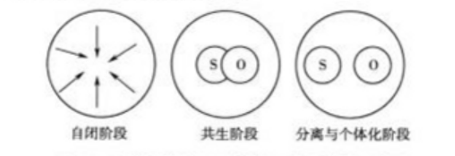
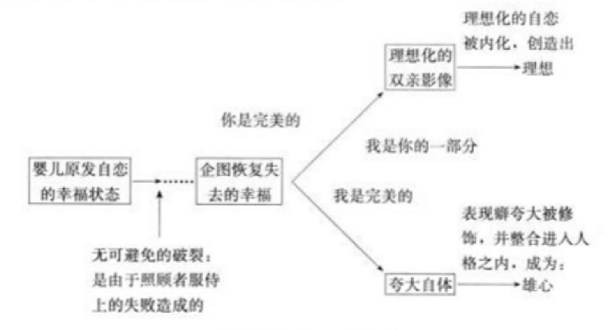
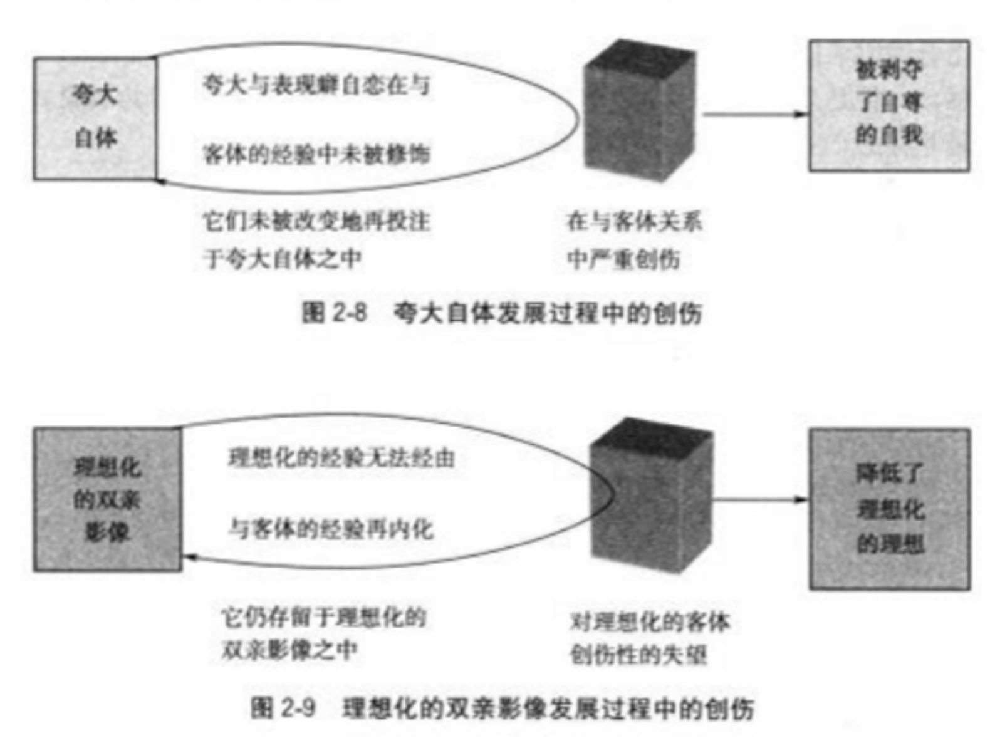
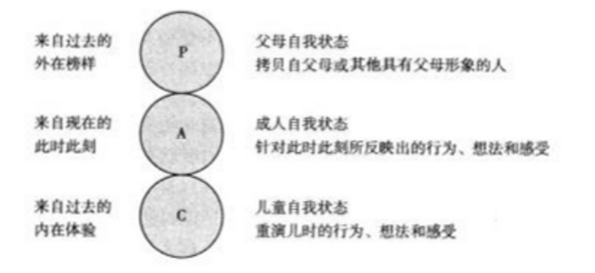
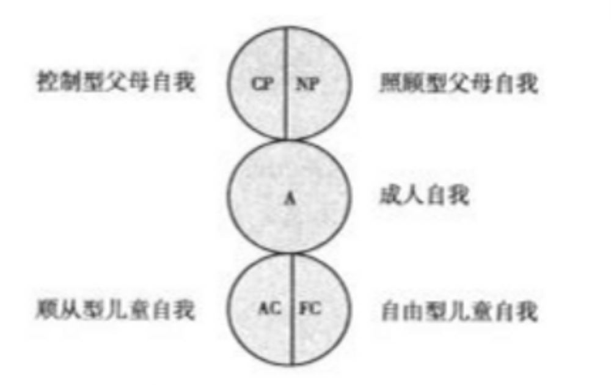
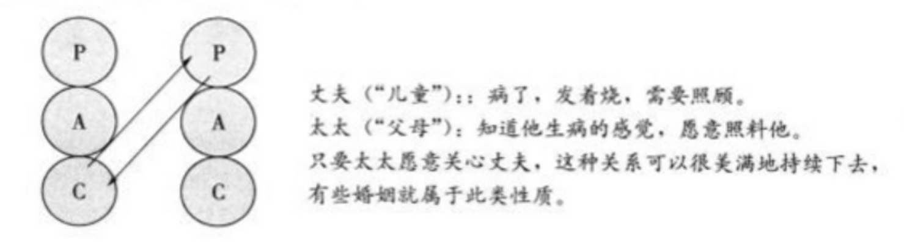
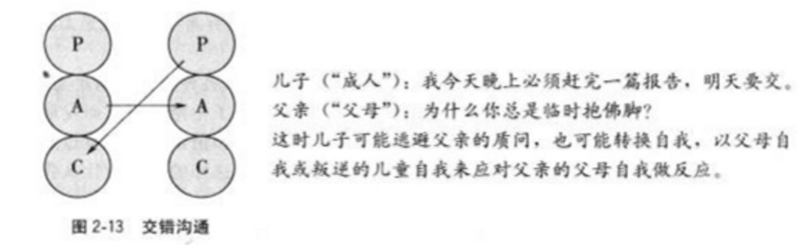
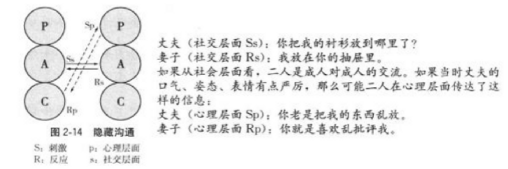

随着心理学研究的不断深入和临床心理学经验的积累，乘持各种心理学理论取向的专家、学者在理论研究中有新的进展，在临床观察过程中有新的发现，推动原有心理学理论学派在继承前人成果的基础上进一步发展，开创出一些具有时代特色的新理论和新方法。这些研究和观察不仅丰富了心理学的内容，促进了心理咨询的发展，还为心理咨询的实践工作提供了新的理念和技术。

## 一、现代精神分析理论

弗洛伊德的传统精神分析理论用性到力解释精神动力、强调幼儿性驱力对人格发展的影响的观点遭到很多学者的强烈反对.在这种情况下,各种新的精神分析理论逐渐发展起来。

### (一) 客体关系理论

客体关系理论起源于 20 世纪 40 年代的英国，创始人是梅兰妮。克莱茵 (MelanieKlein)，其他代表人物有马格丽特“ S " 玛勒 (MargaretS. Mahler) 和奥托.康伯格 (Or-toKernberg) 等。

客体关系理论 (object-relationstheory) 是心理动力取向的人格发展理论，探讨的是婴儿与客体的关系如何影响个体的精神结构以及个体如何由此成长起来，并将人格发展研究的重心从俄狄滑斯期转移到 0-3 岁的俄狄浦斯前期的冲突上。

1. 梅兰妮 克莱茵的客体关系理论

    梅兰妮，克莱茵是儿童精神分析的先驱，她扩展并改良了弗洛伊德的客体和本能的观点。其主要贡献之一就是发展状态 (developmentalPosition) 的概念，它不同于弗洛伊德的性心理发展阶段，而是认为在生命早期已建立的状态，是将持续终生的结构。

    克莱茵认为，任何内驱力和本能都是与客体相联系的。初生的枫儿只能根据他所体验到的客体的“好”或“坏”来代表这个客体，此时，他所体验到的只是客体的部分特征，所以称之为部分客体(partobject) 。贾儿最初的部分客体是妈妈的乳房。此时婴儿生活的目的就是吃怒，当他 (她) 从乳房中吃馅奶获得满足时，他将乳房看成一个好的客体。当乳房中没有奶水、不能满足婴儿需要的时饶，他就将乳房看成一个坏的客体。她认为本能和内上驱力支配着婴儿的内部世界，客体关系以内驱力或本能形式呈现出来。对坏的客体的焦虚与恐惧以及由此产生的恨和攻击性来源于死亡本能。

    1. 主要概念
        
        客体(object) ： 指的是一个被爱着或恨着的人物、地方、东西或者幻想，是一个与自体 (selfD) 相对应的概念； 包括内在客体和外在客体。外在客体是指真正的人物、地方和东西； 内在客体指的是心理表象，即与客体有关的影像、想法、幻想、感觉或记忆，因此也称为客体表象。

        投射： 投射是一个人把自体的一部分归因到另一个人身上。这是一个外化的过程，婴儿借此解除内部焦虚。如当婴儿从乳房中吃饱奶而感到快乐，他会把这好的感觉投射到客体上，相信和乳房是好的。面当他因为吃不到奶而感到饥儿时，他会投射自己的饥铁痛楚到客体身上并处罚客体，这时他会粗暴地咬乳房。

        内摄(introjeetion)：内摄指客体被纳入到一个人的内在，成为内在客体。内摄建立了一个内部世界，部分地反映外部世界。通过这个机制，婴儿内化他对外部世界的感觉。

        分裂(splitting)：分裂是主动的“将自体与重要客体的矛盾经验分开"，即婴儿将客体分裂为好的方面和坏的方面的心理机制。婴儿应用分裂机制，将满足的乳房与被爱的自体相联系，将受挫的乳房与仇恨的自体相联系。

        投射性认同(projectiveidentification)： 投射性认同是指个体把自己不能接受的行为或人格中消极的方面投射或放到别人身上，然后认同于那个人，并在无意识中要去控制他。

    2. 发展状态：发展状态描述的是儿童进行体验的不同途径或处理内在客体和外在客体的方式。 克莱茵指出婴儿的客体关系发展包括两个基本的状态：偏执-精神分裂状态和抑郁状态。

        1. 偏执-分型状态 (paranoid-schizoidposition)： 出生至 4 个月之间。贾儿此阶段特有的体验和防御机制的特征就是“偏执-分裂”- 在此阶段，婴儿对自己的破坏冲动感到焦虑，他认为世界与自己一样是具有破坏性的，他投射自己的愤怒和和恐惧，以分裂的方式分离好与坏两极的情感，以消除内部和外部的迫害。当婴儿对先前满足其需要的好客体 (乳房) 感到失望或肖玫时，客体就不再是原来体验的那个客体，而变成了一个新的坏的客体。

        2. 抑郁状态 (depressiveposition)： 4 个月至 12 个月。此阶段，轴儿的心理快速发展，在与母亲的互动中婴儿逐渐觉察到来自同一个体的好和坏的情感。母亲是好坏兼备的，不是非好即坏或非坏即好。当儿童心中的坏客体与好客体逐渐整合时，儿童会意识到，他对坏客体的攻击会影响好客体，于是产生了内狼感与翡京，从而产生抑全状态。克莱茵认为儿童在经历抑郁状态后，才能将客体看作好坏并存的整个客体，并在此基础上发展出较客观的看待他人与环境的能力。

    克莱茵认为，儿童早期的不良的客体关系影响他以后的客体关系。在治疗中,来访者与客体的关系以移情的方式转移到治疗师身上。一名优秀的治疗师可以通过自己的感受《反移情) 来觉察个案在童年和日常人际生活中形成的“自我-对象客体”关系，然后通过解释与分析，让早期被内化到病人生活中的客体和内在冲突再外化，抵御其存在不良问题的“自我-对象客体”关系，来帮助个案获得领悟，实现发展。

2. 玛勒的幼儿心理发展理论 

    玛勒把客体关系概念集中在一个人的心理诞生方面她认为心理诞生是一个分离与个体化的过程，由此婴儿才能与母亲分离并成为一个独立的个体，

    玛勒在她的著作《人类婴儿之心理诞生》中描述了要儿成长的四个发展阶段，自闭、共生、分离与个体化、客体便久阶段(图 2-6)。每个发展阶段都融入下一阶段，早期阶段存在着下一阶段的基础，在不同的发展阶段会有很多重生出现。

    1. 自闭阶段 (autism stage，0-2个月)： 此阶段又叫“正常性婴儿自闭"，是无客体阶段。要儿只能知觉自己身体的各个部分，而不能知觉到完整的自我。在尚未分化的状态下，既没有完整的自我，也没有完整的客体。这一阶段的任务是新生儿在子宫外完成生物的内环境平衡。他们把大部分时间花在睡眠上，形成一个近似于子宫的隔绝状态，这种状态为新生儿适应子宫外的生活提供了一个过渡-。

    2. 共生阶段 (symbiosisstage，3一8 个月)： 这一阶段，机儿能觉察到一个能满足自己需求的客体，这通常是机儿的母亲。要儿认为母亲 (或最初的照料者) 和自己是一个二元整体，而不是一个可将换的角色。 要儿的微笑表明母贾之间特殊的共生关系已经建立起来。

    3. 分离-个体化阶段 (separation-individuationstage，6一24 个月) 这一阶段心理发展的内容有两方面： 一是分离的任务，包括从心理上与母亲分化、脱离，并与母亲保持适当的距离；二是个体化的任务，即发展个体内心的独立性。分离与个体化通过以下三个亚阶段实现，

        1. 解化(hatching，6一10个月)： 此时期，母亲与孩子的主要动力关系在于知觉区分。随着机儿感觉系统变化，枫儿乏渐体验到与母亲的分离。儿童可以开始探索世界，并且发现世界的范围远不止他身体可触及的范围。在此阶段，婴儿会出现“陌生人焦虑”，这代表婴儿对自体与母亲的进一步分化以及对母亲与其他客体的分化。

        2. 实践 (practicing，10一16 个月)： 儿童进入实践期的显著特征是开始进行四肢疏行。 运动功能驱使孩童探索更广阔的世界，他越来越能离开母亲投入到自己的活动中。但是由于与母亲的共生关系没有被打破，他仍然依恋母亲，定期回到母亲身边寻求身体接触和情感充电，再继续他的探险。母亲的态度决定实践期的儿童是否能够顺利完成分化过程。母亲适当的反应是在与孩子保持情感联结的前提下，适当地推动并鼓励孩子进行实践。儿童的全能感与自恋在此阶段达到了顶峰，特征是陶醉于自己的能力和自己的世界之广大，对失败无动于衷。

        3. 复合 (rapprochement，16一24 个月)： 此阶段的儿音已能觉蛙到自己能力的限制，全能感完全崩溃。小孩在此时期学会说“不"，常常变得相当的抗拒，透过肢体推离和语言来保持自己的分离性。同时他意识到自己对母亲的依赖，也意识到必须把母亲当成另外一个人，母亲不完全被他控制。

    4. 客体恒久性阶段 (24一36 个月及以后) ， 客体便久性 (objeetconstancy) 指维持客体稳定形象的能力。此阶段的儿童能够更集中注意于自己的任务，对母亲忽略一段较长的时间。儿章发展出更复杂的个体感和自体便久性、时间感以及延迟满足的能力也逐渐成热. 客体恒久性和个体化的发展贯穿整个人生。

    

    
图26 玛勒客体关系理论的心理发展阶段示意图

    玛勒认为每一个发展阶段都有其特定的任务、挑战和危机。如果儿童特定发展阶段的任务不能如期完成或突过创伤性事件，便会导致严重的心理障碍。尤其在封闭阶段和共生阶段亲子关系的中断或者过到严重的创伤性事件，就会导致各种严重的心理障碍。当分离与个体化过程均停顿或失败时，常导致精神病或边缘型人格障碍； 当分离过程停顿或失败，但个体化过程正常发展，常导致自恋型人格障碍。玛勒认为，治疗就是让病人重新经历早期的发展历程，达到较高水平的客体关系。

3. 客体关系理论对边缘型人格障碍的解释与治疗”客体关系理论解释边缘型人格，即源于个体在分离-个体化阶段中的创伤和发展紊乱问题。边缘型人格障碍患者的自体与客体表象虽已分离，但仍将事物看作分裂的两极，不能统合好坏、黑白、爱恨、是非等概念，在不同的时间和环境下对同一个人有完全相反的评价。边缘型人格的特征为平时情绪焦虚、易怒、易冲动，长期空虚匠独、优郁不安，如遇压力事件则易导致短暂性精神病，表现出短暂的激动、幻听及妄想等症状-

心理治疗师在对此类障碍患者会谈中应注意使用澄清、诠释等治疗技巧。和澄清即询问进一步信息以其露患者内心的予盾。诠释是对患者病症的形成过程加以解释。边缘型人格者可能在不同时间出现攻击性或内心丝感不安两种情况： 在患者冲突不安时，治疗师表现出包容性和共情的态度可缓解患者的不安，同时可通过人际间的投射认同修正患者投射出来的自体部分，经内摄使其自体得到重建。当患者出现攻击性时，治疗师应表现出足够的宽容和接纳，同时也承认和接纳自己的局限。如此一来，患者就不会把治疗者理想化，也不会认为治疗无效完全是自己的错。需要注意的是，对于边缘型患者而言，限制的设立应该维持在最低程度。

### (二) 自体心理学

自体心理学的理论起源是精神分析和自我心理学，创始人是海因兹。科胡特(HeinzKohut)。他的著作《自体的分析》、《自体的重建%、《精神分析治愈之道)，构成了科胡特自体心理学的完整脉络，其大部分理论来自科胡特对自恋型人格的治疗和分析。

自体心理学把自体放在理论的中心地位，强调自恋的重要性； 但不同于弗洛伊德把自恋看作一种无能(因过于关注自己而无法爱他人或与他人发生关系)。科胡特认为，自态本质上是正常和健康的，它是发展的推动性组织者，对自己的爱先于对他人的爱。

1. 主要概念

- 自恋 (narcissism)： 力比多投注在自我或自体上称为自恋，即人把全部的能量和注意都集中在自己身上。
- 自体：指一个人精神世界的核心，只能通过对外显现象的内省和同理观察才能发现。
- 自体客体(self object) ： 自体客体不是一个分离而实际存在的人，也不是一个实在的生命客体，而是抽象概念的精神内在的表象或被经验为自体需求的拓展。自体客体无能力或缺失是婴儿化冲突与后来病理形成的原因。
- 镜像 (mirroring)： 在自体心理学中，父母对子女的正性反应反射了自体的价值感，并逐靳内化为自体尊重。父母对于儿童活动的欣喜对于儿童的发展是基本的要素。这样镜像反应的结果，儿童能发展并维持自尊和自我肯定的抱负。镜像需求被称为夺大表演欲的需求，因为它们支持贾儿关于“我是完美的，且因此你爱我”的意念。镜像的自体客体是一种回应并确认儿童在活力、伟大与完美上的天然意识。
- 转变内化作用 (transmitinginternalization) ： 透过自体客体这个内在表象，客体在温长的时间里，将与自体客体关系的经验内化并转化为自体结构的一部分，这个内化与转化过程称为转变内化作用。

2. 自恋的发展路线”科胡特同玛勒一样，也相信刚出生不久的机儿会有一种全能感，
但这种状态会因需求得不到满足而被打破。树儿会试图创造两个新的自恋系统，恢复被破坏的全能感，一种是全能自体，一种是理性化的自体客体 (如理想母亲的表象)。这两种自恋系统是并存的，并有各自独立的发展路线(图 2.7)。

    

    
图 2-7 自恋的发展路线

全能自体是源自对完美自体幻想的夸大自体，其特征是表现败、扩张和一种全能的感觉，其体验是“我是完美的"。在自恋的正常发展中，通过镜映，即父母对子女的正向反应，自体的夸大性会有所修正并整合人人格之中，成为适合自我的雄心与目标。

理性化的自体客体是源自寻求一个完美者并与之结合的幻想的理想化的双亲影像。这是由机儿的原始幸福感、全能及完美的一部分投射于父母产生的，认为父母是全能的并能满足自己的任何需求，其体验是“你是完美的，而我是你的一部分”。在自恋的正常发展中，由于儿童会经历来自父母的恰到好处的撑折，理想化的双亲影像被内化而形成理想。

在与父母的互动中，产生了失败的共情，如儿童的一些需要和要求没有被父母满足，一种自体的感觉就发展起来。在全能自体 (我应当获得我想要的) 与理想母亲表象 (我的父母太好了) 之间存在一种紧张状态，这种紧张形成了双极自体。

3. 自体心理学对自恋型人格障碍的解释与治疗”自恋型自体疾患的基本特征是创伤导致的自体结构上的缺陷，病理来自于父母对孩童被镜映以及需要理想化客体的需求长期没有给予同理(empathy) 的回应，致使孩童无法建立起一些必要的心理结构。若夸大自体发展过程中遭遇到严重创伤那么夸大自体不能与自我良好整合。另一方面，如果儿童对理想化的成人感到创伤性的失望，理想化的客体就无法内化，导致儿童不能良好地调整其欲求(图 2-8、图 2-9)。

自体心理学理论强调治疗师对患者主观经验的同理(共情)。在治疗中，患者古老的自体客体可透过自恋的转移关系而被活化，治疗师通过同理向病人指出未得到镜映的孩童时的需要，并提供个案以新的自体客体经验，通过修补缺陷的自体或发展代偿结构，使个案重新建构一个更加统整的自体。

## 二、家庭心理咨询理论

在很长一段时间里，心理咨询一直将个体视为主要对象，但心理学家越来越意识到个体心理咨询所具有的局限性，它过于偏重个体，不能把人放在“系统”中去考察，忽略了家庭以及家人间的互动对个体的影响。因此，随着心理学的发展，他们逐渐把关注的焦点从个体转向家庭成员间的关系和互动上。20 世纪 50 年代中期家庭治疗在美国站稳脚跟并逐渐发展起来。此后，涌现出一批优秀的家庭治疗心理学家，使家庭治疗在心理治疗领域逐渐深入人心。

### (一) 家庭心理咨询的概述

家庭心理咨询(family counseling) 是以家庭动力系统面非个体人格为出发点，集中关注家庭成员问的互动，把家庭看作一个单位或系统。治疗是为了理解和改变家庭的内部结构。

家庭心理咨询的治疗观点符合了新的“生物-心理-社会”的整体思想，适用于范围广泛的心理卫生问题，临床上被应用于神经症、心身疾病、少年儿童心理-行为障碍的治疗，某些精神病(如精神分裂症、双相障碍、反应性精神病等) 和药物依赖、物质激用的康复治疗，以及普通人群中的婚姻治疗、教育辅导等。

最早以家庭作为心理干预对象的是心理学与精神病学家阿德勒 (AlfredAdler)，他于20 世纪 30 年代在伦敦对患精神疾病的儿童及其家庭进行座谈及心理教育，将患精神疾病儿童的治疗与所在家庭系统联系起来。随着系统论、控制论的引入，家庭心理咨询开始得到理论上的支持。精神分析家阿克有曼 (NathanAckerman) 提倡心理学工作者应该把心理干预的重点从“个体”立场推展到“家庭”整体，因而开创了家庭心理咨询的先河。此后，以家庭系统为研究对象的心理干预方法被广泛应用于神经症、行为问题的家庭，不同的咨询模式也得以构建和发展。1962 年 FamilyProcess 杂志的发行标志着家庭心理干预开始成为一个独立的专业咨询与治疗领域，并且发展出了许多介入整个家庭的新策略。

上世纪 70 年代，新的干预技术不断被发展出来。80 年代，婚姻与家庭心理干预结合成为单一的领域。90 年代，家庭心理干预的主流已经远离坚持“学派”的分别，进而走向整合。时至今日，家庭心理咨询正在迅速地成长变化，从实践到理论已越发趋向成熟，并已经成为心理咨询领域的重要组成部分。

### (二) 家庭心理咨询的主要理论体系

家庭心理咨询没有统一的理论，各个家庭心理咨询理论学派对家庭中的问题存在不同理解，这种理解受该学派代表人物先前所受培训的理论背景的影响，并因此发展了不同的咨询技术和于据策略。具有代表性的家庭心理咨询理论主要有历史派、结构派、经验派和策略派等。

1. 历史派

    历史派又称代际治疗派，它受精神分析，尤其是“客体关系”理论的影响很大，因其利用从过去的历史事件和家庭出身中得到的线索去理解和对待当前存在的问题而得此名。Bowen 是这一治疗派别的杰出代表。他提出了八个重要的概念，即“自我分化"、“三角化"、“核心家庭情感系统"、“家庭投射过程"、“情感阻断"、“代际传递"、“排行”和“社会性倒退"。其中关于“自我分化”与“三角化”的讨论是最为核心的。自我分化(differentiationofself)有两个过程： 一是把自我从他人那里分化出来，使自我不受他人的干扰； 二是分辨情绪系统和智力系统，使情绪系统的反应能够适应新的挑战，并向智力系统转换，从而获得控制行为的能力- “自我分化”的核心是一个人与父母的关系。一个健康的人能够不断地与父母进行情绪上的分离。而一个自我分化程度较低的人，其依恋程度很高，结果在人际交往中容易出现“融合”状态，容易将自己和他人的感受和思想相互混滑，从而表现出缺乏自己的真实感受和思想。三角化(triangulation) 是指家庭中如果有两个人之间产生了紧张关系，他们会把第三个人扯进来以稀释这个紧张和焦虚。一般说来，家庭越大，其内部的三角化就越多。一个问题涉及的三角化越多，则家庭成员的卷人程度也就越深。如果家庭内部的三角化不能及时解除，久而久之，整个家庭就会处于一种功能失衡状态。因此，要重新恢复家庭功能的话，就必须解除家庭中已产生的三角化，提高个体和家庭的自我分化水平。

    Bowen 指出，在进行干预时，可以通过评估性面谈、家谱图、分化训练、解释、去三角化等治疗技术改善家庭功能。该咨询模式是以整个家庭系统为干预对象，侧重于发现家庭中反复出现的问题和重复出现的特征性关系，确定家庭系统中成员的互动方式以及家庭规则，找出家庭问题产生的主要原因，以便入手解决。其目标是减轻焦虚，加强自我分化,改变互动的模式。

2. 结构派

    米纽琴(Minuchin) 提出了家庭心理咨询的结构理论。他认为家庭是一个有机的整体并呈现出有层次的结构，家庭中存在的问题常常是由于家庭结构的缺陷和不恰当的等级关系等造成的。当家庭中出现权利之争时，家庭结构就会僵化，家庭组织规则就会变得缺乏可操作性，家庭功能就会受到损害。Minuchin 用边界、结盟和联合等概念来描述一个家庭的结构关系。边界是指家庭结构中子系统或成员彼此的“间隔"。适当的结构必须要有适当的界限。例如，在任何一个家庭里，父母与子女所应发挥的作用和所应担负的责任以及行为的准则和表现的方式都各不一样。这些区别是家庭生活得以正常维持的前提，是必不可少的，否则就会引发各种问题的产生。结盟 (alignment) 是指家庭成员在处理事件时结合或对立的方式。联合(coalition) 是指一些家庭成员联合起来反对其他家庭成员。显然 Minuchin 的“结盟”和“联合”与 Bowen 的“三角化”非常相似。只不过 Bowen 重视的是家庭中的代际关系,而 Minuchin 重视的是家庭的当前结构。因此，Minuchin 认为心理咨询的目标就是要使得家庭规则有一定的可操作性，使家庭结构有一定的弹性，即要使模棚的家庭边界变得明确，使家庭成员行使各自的权利，而不越权。为此，心理咨询师要“介入”这个家庭并容纳它的交往方式.“介入”是指咨询师为了作出诊断，促成家庭产生变化，通过使用同类型的语言、讲与这个家庭有关的有趣故事，来寻求融和人这个家庭，与家庭形成联结的动作。这样可以发现家庭系统的秘密以及经历，觉察家庭在处理外来势力时的惯有模式，从而运用模块化、关系重构去平衡，设置界限和扮演等手段加以干预，以达到心理咨询的目的。

    这一模式是家庭心理咨询领域中应用得最广泛的概念化模型，它以家庭的组织、关系、角色与权力的执行等为关注点，通过调整界恨和重新组合家庭亚系统，改变每个家庭成员的行为和体验，增加脱离的家庭成员之间的交互作用，从而修正家庭结构，最终促进家庭功能的改善。

3. 经验派

    该派的理论葛革人之一 Whitaker 认为，家庭现在出现的障碍是人的成长过程受到阻碍的结果。他指出个人的成长有加于家庭的成长,家庭的成长需要家庭成员之间的情感表达。当家庭缺乏情感表达时，个人成长就受限，从而使家庭功能受阻。Whi-taker 非常强调实用性，其创立的体验疗法较少谈及理论问题，他认为家庭心理咨询不是刻板地运用概念和理解概念的过程，而是一个情感体验和领悟的过程，心理咨询师应该靠直觉、靠自己的经验来工作。Whitaker 认为心理干预的基本目的在于启发和提升家庭成员的自主性和归属感。为了能帮助人们尽快地通过体验而达到领悟，他经常通过观察迅速捕捉住家庭关系或家庭成员中所表现出来的不当或不合理之处，然后使用夸张的手法让来访者意识到行为的荒座之处，从而让来访者降低焦虑，消除三角化，加强家庭成员间的情感表达，以促进家庭和个人的成长。他确信这种把家庭病理现象展示在他人而前的夸张的手段最终会导致病理症状的消失。

    另一位代表人物萨提亚强调情感体验，也强调沟通。萨提亚最明显的特点是其鲜明的人本主义模式。萨提亚认为人的成长从受孕那刻就开始了，在整个成长过程中影响个体发展的有三个因素： 第一是遗传基因； 第二是家庭系统中长期的影响力； 第三是家庭成员中持续的身心互动。萨提亚特别重视人的自我价值，她认为每个人都具有正向的成长潜能和动力，这赋予了人们同一的本质和平等的价值。所以自我价值绝不是我们是否拥有它，而是我们如何去体现它，而个体是在他与家庭成员及其与其他人互动时发展出自我价值感的。萨提亚认为： 功能失调的沟通是家庭系统功能不良的特征。她归纳出五种家庭沟通模式： 讨好型、指责型、超理智型、打岔型和一致型。前四种都是不良沟通或低自我价值的体现，面一致型沟通才是真实和真诚的表达，传达出语言与非语言和谐一致的信息，并且沟通者能为此负责。萨提亚认为，治疗中最重要的是要帮助家庭及其成员建立自新，增进自我价值，发现并改正家庭沟通的差异，最终形成和谐一致的沟通模式，从而帮助家庭获得健全的生活方式。

4. 策略派

    与 Minuchin 一样，Haley 看到了家庭成员之间的相互作用，同样用权利争夺的观点来看待家庭关系，并指出如果家庭的权利关系失衡就会引起家庭的三角化，从而导致家庭功能失调。所不同的是，Haley 更关心家庭当前发生的症状，他认为症状是特定情境的产物。由此，他进一步作出推论： 一个人表现出某类症状，实际上是一种试图在人际关系中获得支配地位的手段和策略。也就是说，某个家庭成员在努力地通过显示症状来改变并重新建构家庭关系的平衡状态，并使自己处于重要的位置。他强调心理咨询的目标是问题的解决，而不是领情，因此心理咨询师要试图寻找并激起被“卡”住家庭的互动模式。由于现存的问题是家庭成员都没有意识到的，所以咨询师在对家庭问题的本质有动态性了解的前提下，为家庭选择适合这个家庭的任务，着眼于改进认知上的基本问题，建立一套有步又、有层次的干预策略，使家庭能够意识到问题的症结所在，促使家庭去解决所存在的问题，以恢复家庭的正常功能。所以，策覆派非常注重与权力分布有密切关联的家庭结构，并且努力寻求用以应对那些较为闫固的失调行为模式的治疗技术和方法。

### (三) 家庭心理咨询的主要技术与方法

家庭心理咨询各派别之间的具体理论和模式各不相同，所采用的技术方法也不尽相同，但这些派别又都有一些共同之处。任何一种家庭咨询都坚信来访者所存在的问题不过是症状而已，而家庭本身才是真正的干预对象。心理咨询师们都采取积极的干预策略，来改善整个家庭的功能。在家庭心理咨询中，常用的技术方法有如下几种：

1. 提问策略 和个别咨询不同，家庭咨询师不和家庭成员探讨它的个人问题，主要是通过提问的方法，促使家庭互动。提问策略是家庭治疗中的重要技术。

    1. 关系性提问： 家庭成员总是会诉说症状本身，或一个人的问题 咨询师要设法将症状问题变成一个关系问题。关系提问的要点是抓住家庭成员诉说内容或行为中隐藏的和其他成员的关系.不从症状本身，而是从相互作用的角度提问。

    2. 循环提问： 也被称为“循环催眠"。就是同一个问题，轮流反复地请每一位参与治疗的家庭成员回答。这种提问方式会在家庭内部制造差异，从而引发家庭成员对差异的比较和思考，具有较强的启发性和暗示性。可以运用于治疗初期对于家庭信息的收集阶段，也可以用于后期的反思领司阶段。

    3. 差异提问： 指的是向各位家庭成员询问，家庭问题出现前后在时间、场合、人员等情境方面的差异。差异提问就是要帮助来访家庭意识到问题发生所需要的条件情境，提醒他们看到问题积极的一面，也就是通常所说的“寻找例外"。然后再比较差异出现的条件， 寻找问题出现的环境因素,根据比较结果为症状的消除创设或调整相应的环境。

    4. 假设提问： 治疗师根据对家庭关系及背景的了解从不同角度对家庭的问题提出假设。通过这种提问，治疗师能够为来访家庭展开另一房门，提供看待问题、思考问题的多重和角度。运用假设提问一方面可以帮助治疗师理清症状与家庭成员关系之间的联系，另一方面也可以促进家庭成员换位思考。

2. 家庭图谱 (family mapping) 这是一种用来直观表现家庭内部成员之间关系的技术。 可以将来访家庭希望解决的问题与家庭成员之问的关系通过图形线条的方式进行展示。家庭图谱通常是由治疗师和家庭一起完成的，应该是得到所有家庭成员认可的家庭内部组织关系图。如果家庭成员间对某些关系或问题存在差异，也可以邀请他们各自描绘家庭图谱，而图谱与图谱间的差异往往就是问题的核心。一般而言，家庭图谱可以包括以下这些信息： 家庭成员之间的联系、亲近程度、重大转折 (如出生、死亡、结婚、离婚等) 、家庭的重要特质(如家庭的文化传统、宗教信仰、社会经济地位、种族、受教育情况等) 。

    使用家庭图谱可以表现家庭内部成员之间的关系。从家庭治疗的角度看，个人问题是和家庭关系的失调相联系的。许多个人问题可以通过家庭关系的调整得到解决。或者我们也可以说，个人问题就是家庭问题，二者是不可分的。通过至少三代家族图谱，家庭成员和家庭治疗师可深刻地了解个人问题行为产生的真正原因。

3. 雕刻(sculpt) 通过具体造型的生动形象可重新建立家庭成员之间的关系。这种造型象征着家庭中的每个成员(或各成员依次轮流) 安排其他人的具体位置，借以明显地表示他对家庭相互作用的观点。有时还要求这位“玲塑家”把自己摆进雕塑之中，让治疗者以辅助配角的身份取代他在塑造中的位置。还可以要求各成员按各自喜爱的方式处理家庭造型，表明某些成员所采取的态度，从而依次看出这种态度的“感受”如何。因此，这一技术可用来诊断或确定治疗目标，而用不同成员充当雕塑者的做法又可显示他们在理解和意志上的差异，台塑作为一种行为技术，可使儿童和说话少的家庭成员也有机会参加治疗。

4. 模拟家庭(simulation of family) 通过模拟家庭的角色扮演，让家庭成员在某种家庭情景中去感受他们自己，有时会产生意想不到的领悟。如让家庭成员模仿彼此的行为表现，女儿扮演她所看到的父亲，父亲扮演他眼中的女儿等。

5. 积极建议(positive connotation) 对当前的问题重新界定，从积极的方面重新进行描述。引导家庭成员从一个新的角度去看待问题，放弃挑别、指责态度，增强他们的信心。在这个过程中，强调问题的产生是和特定情境联系的，情景是可以改变的，问题也是可以解决的。

## 三、交互分析与心理咨询

交互分析 (transactionalanalysis，TA)，最先由心理学家艾瑞克“。 伯恩提出，它是一种人格理论、一个慨念性的沟通工具、一种针对个人成长和改变的系统性的心理治疗方法- 治疗师通过描绘人的心理结构以解释不同自我状态如何影响人的行为，用脚本的概念解释童年经验如何影响现在的生活方式，并通过个别治疗、团体治疗、夫妻治疗或家庭治疗等方式来促进个人的成长和改变。时至今日，交互分析已经在心理咨询理论和实践中占据了重要的一席之地。

### (一) 交互分析基本理论

1. 结构分析一一自我状态结构与功能”根据伯加及其追随者的观点，我们每个人有三种自我状态： 父母、成人和儿童。每个自我状态都是一个情感、思想和行为的有组织的心理系统，且每个都是独特且相互排斥的。在健全人格中, 个体可以根据环境的不同展现不同的自我状态，而达到有效的沟通。

- 儿童自我状态 (childego-state) ： 儿童自我大部分诞生于童年期，来自内在的反应和经验，当个体按照小时候的思想、感觉或行为模式来做反应时，他就处于儿童自我状态中。例如与男朋友吵架时，因生气而哭泣或不理人。

- 父母自我状态 (parentegorstate)： 类似于儿童自我，父母自我大部分也诞生于童年期,来自外在的榜样，例如父母、老师等。当个体的行为、想法和感受拷贝自父母 (或其他具有父母形象的人)，或运用小时候认知到的父母的表达方式来做反应时，他就处于父母自我状态中。例如小的时候，每当母亲在忙碌时，脸上总会露出皱眉头的表情，孩子长大以后不自觉的也会在忙碌时，流露出类似的表情。

- 成人自我状态 (adultego-state) ： 个体行为、想法和感受都是针对此时此刻发生的现实做反应，运用成人的资源来面对现在，这时个体就处于成人自我状态中。例如工程师设计草图、法官办案、医师诊病。成人自我状态不处理情感只处理事实，用以检测现实并关注事件的处理、评估和决策。

一般来说，没有哪种自我状态代表好或者不好，关键在于个体是否能够以合理的方式运用，并适时适地选择一种自我状态使自己感觉更舒服。

这三个自我状态按照图 2-10 的方式结合在一起，就形成了TA 理论的核心：自我状态模式。传统上，把它画成三个相连的圆圈,各以其第一个字母的大写为名，故也称之为 PAC 模式。

图2-10 自我状态模式图

从功能的角度来看，PAC 模式可以让我们明白不同的自我状态是如何运作的。这种对行为过程的描述方式让我们从另一个角度来了解人格。它将 PAC 模式按如下结构划分

图2-11 PAC 功能模式

- 控制型父母自我状态 CP： 当个体拷贝父母带有命令和控制性质的行为时，就处于控制型父母自我状态。从功能上它也可以分为正面的控制型父母自我和负面的控制型父母自我。前者对别人发出的指示是真的想保护别人或希望别人受到益处，例如医生命令病人“不许抽烟"； 后者这种父母自我的行为隐含对别人的轻视味道，例如老板对秘书喊“你又犯同样的错误了”。

- 照顾型父母自我状态 NP： 当个体表现出父母照顾自己时候的行为，个体便处于照顾型父母自我。 例如，别人受伤，你安慰别人，帮他包扎伤口。从功能上它也可以分为正面的照顾型父母自我和负面的照顾型父母自我。 前者从真诚尊重的立场来帮助别人，例如同事需要帮忙时，你说“这件工作需不需要我协助，如果有需要就告诉我"，后者状态下提供的帮助则有高高在上、漠视别人的意思，例如令人窒息的母亲包办孩子的一切。

- 成人自我状态 A： 客观、理智地思考、决定、评估，如计算机般处理事务，从各个不同角度收集资料作为参考，以冷静的计算和推理，来作为事情的决断。

- 顺从型儿童自我状态 AC： 这种自我状态从行为表现可分为摄递和顺从两类。顺从型是指个体在孩提时，大部分都顺从父母或其他具有父母形象的人，长大后仍然常常重复这些小时候所决定的行为，以符合父母的期望； 拓闭弄是指个体小时候反抗父母加在身上的规矩和期望，尽可能违背这些规矩，长大后会以不同的方式反抗生活中的各种规矩。

- 自由型儿童自我状态 FC： 个体小时候的行为与父母的压力无关。既不顺从也不反抗，单纯地做自己想做的事情，长大后自己的行为也完全不受别人影响。

在以上五种自我功能中，每一个都有其重要性，也都各有其好坏之处。因此，重要的是在了解它之后，你将学会如何去运用你的时间和精力。事实上，就一个健康、平衡的人格来说，三种自我状态都是必需的。我们需要成人自我状态来处理此时此地的问题，帮助我们有效率地生活； 为了更好地融入社会,需要父母自我状态提供规范来遵守； 儿童自我状态则包含自发性、创造力和直觉力，对于生活和工作也是不可或缺的。

此外，杰克杜谢曾提出这样的恒定假说：一个人所能投注在这五个功能性自我状态的人能量总和是固定的，如果某一个自我状态的强度增加，那么其他自我状态就会呈现代偿性地减少。要改变自我的最好方法就是去提高想要增加的项目，当这样做的时候。能量自然会从希望减少的项目流出。比如，起增加自己的照顾型父母，减少控制型父母，就开始练习用更多的照顾型父母的行为，控制型父母的行为自然就会减少。

2. 沟通分析 ”伯恩认为交流是沟通的基本单位，并有如下定义：一个刺激 (S) 加上一个反应 (R) 就是一次交流。人和人之间的沟通就是一连串的交流形成的。结合自我状态的概念，我们认为发生在两个人之间的任何事情都牵涉到他们自我状态的表现，因此沟通可以看作一个人的不同自我状态与另一个人的自我状态交换信息的过程。结合沟通的三个定律，可以将沟通分为三种类型：

    1. 互补沟通(complementary transactions) ： 当刺激和反应在 PAC 图表中成平行线时，这个交流是互补的，可以永远继续下去。只要交流是平行的，方向无所谓。例如“儿童”一“父母”的沟通(图 2-12)。

    

    
图2-12 互补沟通

    沟通定律一： 只要交流符合原先的期待，保持互补状态，沟通就能一直进行下去。

    2. 交错沟通 (crossedtransactions)： 当刺激和反应在 PAC 图表上发生交叉时，交流停顿。这时作出反应的自我状态并非对方所期待的自我状态，导致沟通交错而中断。此时，人们可能退缩、逃避对方或者转换沟通方式。例如，成人对成人的刺激因为父母对儿童的反应而导致沟通交错《图 2-13) 。

    

    
图2-13 交错沟通

    沟通定律二： 当交流呈现交错状态时，沟通会被打断，这时一方或双方需要改变自我状态，才能继续沟通下去。

    3. 隐藏沟通 (ulterior transactions) ： 隐藏沟通中常常包括两个以上自我状态，成人自我之间交流的是一个公开的、社会层面的信息，而同时会在其他自我状态之间交流另一个隐藏的、心理层面的信息。这需要结合当时的行为表现来确定。它有时是双重的(人包含四个自我状态，见图 2-14)，有时是三角形的(包含三个自我状态) 。

    

    
图2-14 隐藏沟通

    沟通定律三： 隐藏沟通的结果取决于心理层面的内容，而非口头社会层面的信息。

3. 脚本分析

    Berne 认为所谓的脚本 (scripts) 是指小时候在潜意识中萌发的人生蓝图，被父母加强，又被后来的生活事实证明，并可经选择而改变。脚本约在一个人2岁时开始形成，约 7 岁时大致完成。脚本主要来自成长时父母的影响，但孩子并非被动地全盘接受。他们靠自己的经验得出结论，找出一些理解这世界且让自己的存在有意义的关联。

    生活位置是脚本的核心成分。在不同的影响下，儿童可能会形成不同的生活位置。生活位置有四种形态，@我行，你也行 (1"mOK-YouareOK)： 这可能是反映儿童如何进入外界时的一种生活位置。只要儿童的情感和生理需要以一种喜欢和接受的方式得到满足，儿童就会保持这种位置，并且形成成功者的脚本。@@我行，你不行 (TD"mOK-YouarenotOK) ，如果儿童受到了错误的对待，他就会觉得别人不行，这实质上是一种对自己“不行”的基本情感的防御。处于这一位置的人经常责备和不信任别人，并且对外界以欣折或愤怒作出反应。回我不行，你行 (IT"mnotOK-YouareOK) ，如果儿童的需要没有得到满足，他们也可能会认为自己是在某个基本的方面有缺陷。这是最常见的一种生活位喷，经常处于这个位置的人会感到内疾、抑郁、自卑以及奴惧。轩我不行，你也不行(CTmnotOK-YouarenotOK) ： 如果缺少安抚或都是极端消极的安抚，儿童就可能会觉得“我不行，你也不行”。由于没有任何积极的安拓，贾儿就会放弃希望，也就是无法养成希望的品质，往往感到无助。

4. 心理游戏与游戏分析

    从童年开始，我们为了生存学会以各种方式来满足需求。特别是小时候，当我们真实表达自己需要和感觉时，因草受到了拒绝、和否定而发展出一套生活规则，以暖昧的方式来要求自己想要的情感和需要。相信很多人都有过这样的经验，在和别人互动结束后有很不舒服的感觉，并且总会说这样的话“为什么我老是过到这样的事”、“我想他应该和别人不一样，为什么又……”这种周而复始的经历虽然会改头换面不断发生， 但是每次都会以负面感受而结束。这就是我们上文提到的心理游戏。它是个体与他人为了获得安抚，双方都获得负面感受的过程。玩心理游戏的人是在封闭系统中作思考，不接受外来的新信息，面使用自己过去的方式、感受和信息作出决定。

    首先，我们来看一个案例：

    :::info 场景

    简是一个咨询师，他正在和一个沮丧的来访者会谈。

    来访者： 发生了可怕的事，房东把我赶走了，我不知道该怎么做了。

    简 (委眉)： 真是太糟糕了，我能帮你做些什么?

    来访者(无精打采地)： 我不知道。

    简： 为什么不找报纸看看是否能租到房子呢?

    来访者： 这就是问题所在，我没钱付房租。

    简： 我可以安排你拿到一些救济金。

    来访者： 你真好，可是我不想接受别人的救济。

    简，那我安排你暂时住到青年旅社，直到你找到新的居所为止。

    来访者：谢谢，可是我心情这么低落，恐怕无法忍受和许多人一起住。

    简努力想是否有其他办法，可是脑子一片空白。

    来访者叹了口气，站起来说：“谢谢你试图帮助我”，然后快快不乐地走了。

    简自问：“到底是怎么回事?”她开始时觉得惊讶，随后觉得无力而诅形，自己实在不是个好的社会工作者。

    同时，走在街上的来访者也对简很生气，他说： “她不是说要帮我的吗? 结果什么忙也帮不了。”
    :::

    类似的情形，他们两个过去都发生过很多次，简常想帮助来访者，为他们提建议，但是来访者不接受让她很不人知服， 来访者不断拒绝别人帮助，并对试图帮助他的人感到生气。

    然后，我们来看伯加对心理游戏的定义： 一系列连续进行的互补隐藏式沟通，进展到一个明确且可预期的结果。公式如下：

    饵 + 猎物 = 反应 → 转换 → 混乱 → 结局
    
    最后，我们把这个心理游戏案例放入公式来分析。

    1. 当来访者告诉简自己被房东赶走时，就隐藏了一个饵，意思是“虽然你尝试要帮助我，但是我不会接受的"，这时简就成了猎物。因为无论是她的工作性质，或者她头脑中的父母讯息都告诉她说,“当别人遭遇不幸的时候，你必须帮助他"。

    2. 反应阶段包括一连串的互动。从社交层面看，简不断提建议，来访者一一否定心理层面上，则是饵和猎物之间好几次交换着隐藏信息。

    3. 转换阶段发生在简无计可施时候，来访者说“谢谢你试图帮助我”

    4. 来访者离去，简觉得惊讶，这就到了混乱阶段。

    5. 结局是二人都效得了习惯的扭曲感觉，简觉得自己能力不足，来访者觉得愤怒。

相信这种感受对于简和来访者来说是很熟悉的，伯恩将之定义为扭曲的感觉。它是通过正、负向安拢的增强、漠视，并以父母为榜样而学习来的，是一种人为、重复且定型的感觉。每个扭曲感觉的背后都有另一个真实的感觉，但是孩子在成长过程中为了更好地求得生存，而不得不将之压抑，取代以更强烈的方式表达被允许的感觉来补偿自己。为什么人们获得扭曲的感觉却总是要周而复始地玩这样的心理游戏呢?

伯恩认为，人类普遍存在三种需求，分别是认可需求、刺激需求和结构需求。个体可以通过心理游戏获得认可和安抚，以证明自己的存在，同时也运用不同的时间结构进行着各种沟通。所有的心理游戏都不是从成人自我发出的，人们也多半不会察觉到。

因此，治疗师单舍提醒一个人正在玩游戏对于个人成长是毫无帮助的，必须一步步地慢慢告诉他什么是心理游戏，如何通过觉察、了解自己目前真正的感觉和需求，用成人的方式来面对当下作反应，这才会对来访者产生实质性的帮助。

### (二) 主要技术与方法

根据交互作用分析的理论基础，儿童早期的行为很可能存在满足自己的需要与满足父侠的需要不平衡，以致儿童最后话化到表达自己的情绪是不安全的，容易使儿童形成不良的生活脚本。另一个原因是自我结构中三种自我状态的相互污染。Berne 认为理想的自我结构中的 PAC 是不应该相互重故的，一旦发生了重枚就意味着被污染，除了被污染之外，还存在排床。所谓的排斥表现为带有成见和先入为主的看法，只要面对威胁，这种看法就始终不变。在各种情况下，互为补充的双方之间的防御性排斥，是产生固执“父母"、固执“成人"、固执“儿童”的主要原因。针对这种理论解释，交互作用理论提出了以下几种技术方法；

1. 强化松散的自我边缘技术”向求助者解释自我状态的理论，理解“父母"、“成人”、“儿童”三种自我状态的含义，热悉这三者彼此问交互的功能。求助者能够用上述的知识来处理自己的行为时，则自然可以强化自我边缘。

2. 去污染技术 让求助者了解到自己受污染的状况，并指出谁在污染谁，如何污染，以达到去污染的效果。作为咨询师要及时指出求助者的成人受谁的污染，并通过认知的前析，修正当事人的现有状态，以重建当事人和谐流畅的自我状态 。

3. 青倾泻技术”倾泻是指个人的一个自我能很稳健且直接地转换到另一个自我。再倾泻 (recatharsis) 是指求助者所排斥的另一个或另两个自我状态激发出来，使当事人的行为反应能因环境的状况与需要，随时倾泻或呈现更适宜的自我状态 。

4. 回溯技术 这是发现求助者受父母影响的一种有效方法。它要求求助者要申明而不是否认自己的消极情感，找出自己的哪一部分对自己的自然儿童状态产生了伤害，找出最近发生的什么事情触发了自己的消极情感，理解父母对自己的说法看法以及它们怎么影响自己的儿童自我状态，看看自己现在能做的以申明自己不同的事情。

    个体遭遇的困扰是由童年早期的决定造成的，困扰的消除就是改变童年的早期决定，并作出新的决定。 回潮是力图让当事人回到最原始的冲突情境之中，由治疗师提供机会让当事人以新方式来处理该情境。

5. 澄清技术 指咨询师将求助者所说的话或想说的相关信息串联起来，或把求助者内降而未显且未能明白表达的想法与感受说出来。澄清的目的是使求助者对于未来将发生的事情及原因能有深刻的洞察与了解，以便在咨询后求助者可以很自主、自然地回到现实生活中，以适当的方式去处理日常事务并与人沟通。
