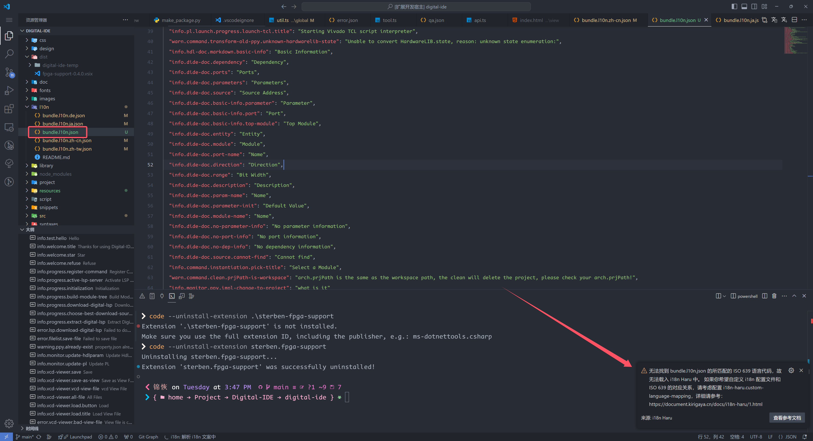
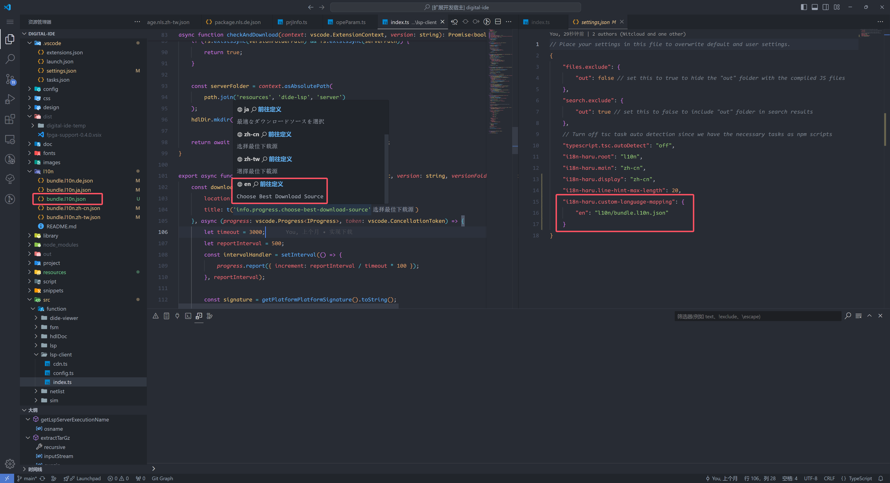

## i18n Haru 构建【语言-配置文件】对应关系的逻辑

在绝大部分情况下， i18n Haru 能够正确地根据你的配置的 `i18n-Haru.root` 下的所有 json 文件根据它们的名字叫将它们识别为对应的 ISO 语言代码。

比如对于下面的工程

:::: code-group
::: code-group-item 项目结构
```markdown
📦.vscode
 ┗ 📜settings.json
📦l10n
 ┣ 📜bundle.l10n.de.json
 ┣ 📜bundle.l10n.ja.json
 ┣ 📜bundle.l10n.en.json
 ┣ 📜bundle.l10n.zh-cn.json
 ┗ 📜bundle.l10n.zh-tw.json
```
:::
::: code-group-item setting.json
```json
{
    "i18n-haru.root": "l10n"
}
```
:::
::::

i18n-Haru 往往会把 `l10n` 下的文件与它们的 ISO 代码解析为如下的 【语言-配置文件】 对应关系：

```
🎯de    --> 📜bundle.l10n.de.json
🎯ja    --> 📜bundle.l10n.ja.json
🎯en    --> 📜bundle.l10n.en.json
🎯zh-cn --> 📜bundle.l10n.zh-cn.json
🎯zh-tw --> 📜bundle.l10n.zh-tw.json
```

基本的解析逻辑就是去除上面的 i18n 配置文件的后缀名和 **最长共同前缀**，然后用剩余部分去贪心地匹配所有的 ISO 639 代码。因此，建议读者在开发 i18n 项目时，采用统一前缀式的命名格式，类似于 `<prefix>.<ISO Code>.json`， `<prefix>` 可以是任意具有一定语义的字符串，比如我这里采用了 vscode 内置 i18n 插件的前缀 `bundle.l10n`， bundle 在前端开发中往往代表一类静态资源； l10n 则是 localization（本地化）的缩写，它和 i18n 是一个意思，但是 i18n 的使用更加广泛。这样命名，让同行工程师一看就知道这是用来做 i18n 的静态资源包。`<prefix>.<ISO Code>.json` 中的 `<ISO Code>` 则是代表 ISO 639 Code，比如 zh-cn（简体中文）、zh-tw（繁体中文）、en（英文）、ja（日文）、de（德文）等等。

:::info
不了解 ISO 639 代码的朋友，可以看下面的文章
<detail-url
    href="https://kirigaya.cn/blog/article?seq=68"
    title="自然语言的ID——ISO 639语言编码标准"
    logo="kirigaya"
    desc="ISO 639 是用来分类语言的标准命名法（术语）"
></detail-url>
:::

## 自定义【语言-配置文件】映射关系

如果因为一些工程需求，我需要强制把一个 ISO Code 映射到一个自定义文件上呢？这确实是一个合理的需求，在一些美国人写的 i18n 框架中，会默认没有写入任何 ISO Code 的文件代表 en-US（美式英文）语言的配置文件，比如 `bundle.l10n.json` 就应该对应 en 这个 ISO Code，但是实际情况下， i18n-Haru 是无法获取到这个信息的，比如这个项目：

:::: code-group
::: code-group-item 项目结构
```markdown
📦.vscode
 ┗ 📜settings.json
📦l10n
 ┣ 📜bundle.l10n.json
 ┣ 📜bundle.l10n.de.json
 ┣ 📜bundle.l10n.ja.json
 ┣ 📜bundle.l10n.zh-cn.json
 ┗ 📜bundle.l10n.zh-tw.json
```
:::
::: code-group-item setting.json
```json
{
    "i18n-haru.root": "l10n"
}
```
:::
::::

当 i18n-Haru 扫描 `bundle.l10n.json` 会发出如下的警告：



从而造成如下的解析结果：

```
🎯?     --> 📜bundle.l10n.json
🎯de    --> 📜bundle.l10n.de.json
🎯ja    --> 📜bundle.l10n.ja.json
🎯zh-cn --> 📜bundle.l10n.zh-cn.json
🎯zh-tw --> 📜bundle.l10n.zh-tw.json
```

这显然是我们不希望的，此时可以通过警告里面的提示信息，来设置 `i18n-haru.custom-language-mapping`：

:::: code-group
::: code-group-item setting.json
```json
{
    "i18n-haru.root": "l10n",
    "i18n-haru.custom-language-mapping": {
        "en": "l10n/bundle.l10n.json"
    }
}
```
:::
::: code-group-item 项目结构
```markdown
📦.vscode
 ┗ 📜settings.json
📦l10n
 ┣ 📜bundle.l10n.json
 ┣ 📜bundle.l10n.de.json
 ┣ 📜bundle.l10n.ja.json
 ┣ 📜bundle.l10n.zh-cn.json
 ┗ 📜bundle.l10n.zh-tw.json
```
:::
::::

这样，我们就手动完成了配置，将英文的 ISO Code en 映射到了 `l10n/bundle.l10n.json`。 `l10n/bundle.l10n.json` 内的内容也会被用来填充 en 部分的 message 和对应的 content。如下图所示，配置完成后，en 对应部分也出现了悬停提示上，代表自定义映射正常工作。（如果遇到修改自定义映射不生效的问题，请重启 vscode）



:::info
上述配置的对应关系是优先级最高的。比如对于下面的项目
```markdown
📦.vscode
 ┗ 📜settings.json
📦l10n
 ┣ 📜bundle.l10n.json
 ┣ 📜bundle.l10n.en.json
 ┣ 📜bundle.l10n.zh-cn.json
 ┗ 📜bundle.l10n.zh-tw.json
```
假如你通过 `i18n-haru.custom-language-mapping` 将 en 配对到了 `bundle.l10n.json`，那么原本的 `bundle.l10n.en.json` 就会被覆盖。相当于 `bundle.l10n.en.json` 不存在。
:::

