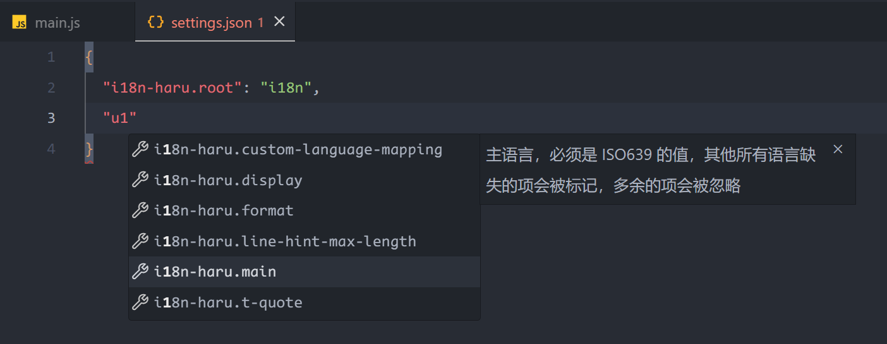

## 基准语言

对于 i18n 而言，基准语言（base language）非常重要，这是整个 i18n 系统的基准，整个系统有哪些 i18n message key 完全根据基准语言的配置文件来，基准语言文件没有的 message key 就算别的语言文件有，在 t 函数里面也不应该被映射出，这只是一个用来进行管理维护的标准，并非什么具有编程原理的东西。

在 i18n Haru 中，通过配置 settings.json 中的 `i18n-haru.main` 可以设置 i18n 基准语言。

:::: code-group
::: code-group-item settings.json
```json
{
  "i18n-haru.root": "i18n",
  "i18n-haru.main": "zh-cn"
}
```
:::
::::



设置了基准语言后，其他所有语言缺失的项会被标记，多余的项会被忽略。


## 渲染样式

i18n Haru 在成功配置后，会在代码的 t函数 后面渲染这个 message key 对应的文本内容。


这个渲染的文本默认是你的基准语言，默认最大渲染长度为 10 个，如果你想要更换渲染的语言，可以通过设置 `i18n-haru.display`，最大渲染长度可以通过设置 `i18n-haru.line-hint-max-length` 来实现。

:::: code-group
::: code-group-item settings.json
```json
{
  "i18n-haru.root": "i18n",
  "i18n-haru.main": "zh-cn",
  "i18n-haru.display": "ja",
  "i18n-haru.line-hint-max-length": 50
}
```
:::
::::

效果为

