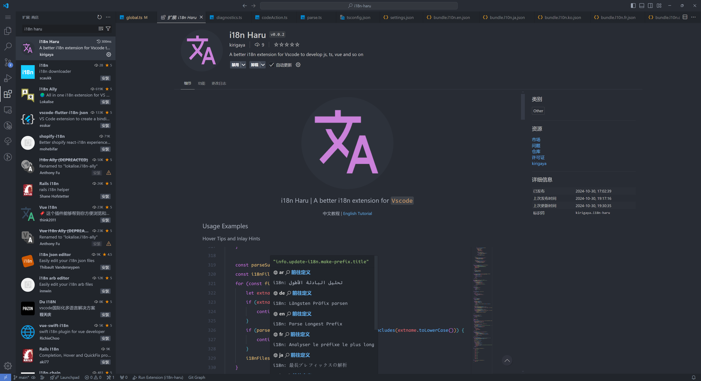

## Vscode 应用商店

i18n-Haru 作为 vscode 插件，只需要在 vscode 中搜索便可以直接下载使用。步骤如下：

1. 打开 vscode
2. 点击左侧的应用（Ctrl+Shift+X）
3. 在输入框中键入 `i18n haru`
4. 在显示出的第一个插件，点击【安装】即可



## 源码安装

对于动手能力强的用户而言，可以从源码（如果你需要自定义什么功能的话），命令如下：

```bash
git clone https://github.com/LSTM-Kirigaya/i18n-Haru
cd i18n-Haru
npm i
vsce package
```

上面的步骤会生成名为 `i18n-haru-{version}.vsix`, `{version}` 是版本号，此时直接安装即可：

```bash
code --install-extension i18n-haru-{version}.vsix
```