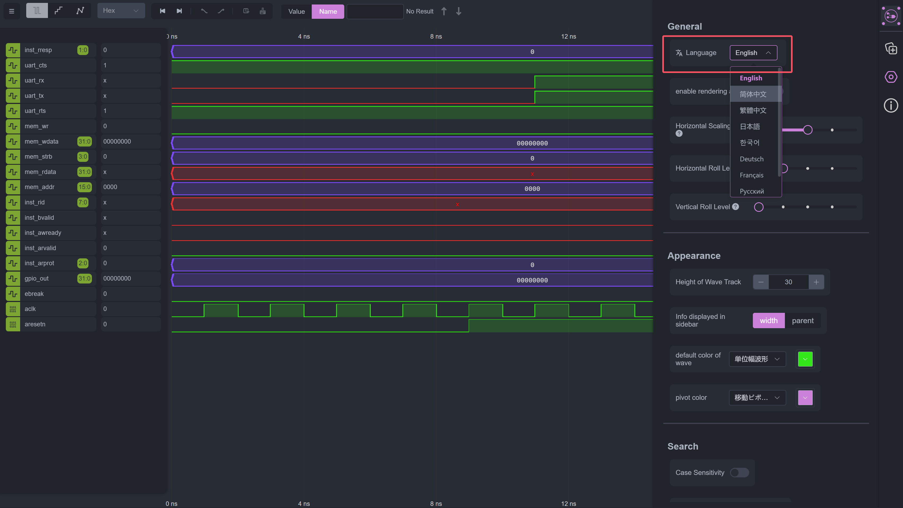

## 什么是 i18n ？

国际化（Internationalization，简称 i18n）是指设计和开发软件应用时，使其能够适应不同语言、地区和文化的过程。i18n 的目标是让软件能够在不进行代码修改的情况下，支持多种语言和地区的用户。

简单说，当你打开一个软件，网站或者游戏，如果是英文界面，大部分用户第一想要找到的东西就是将这个软件的语言调整成自己所在地区的语言，比如简体中文。下面的图中展示了我曾经开发的一款 VCD 渲染器的语言切换模块，右上角中只要点击【简体中文】，整个软件所有英文的地方就会变成简体中文。负责实现这个功能的底层模块就称为 i18n。




:::info
软件开发中，i18n的上下文语意有如下表达：
1. 你的软件做 i18n 了吗？这通常代表“你的软件做多语言适配了吗？”
2. 你用的 i18n 框架是什么？这通常代表“你实现多语言的库或者框架是什么？”
:::

i18n 在过去是令诸多软件开发者头疼的问题，因为大部分软件开发者或许技术功底了得，但是大部分人都不可能熟悉8国外语，而且曾经的翻译器对于软件中的很多术语翻译都不准确，这些统统被称为 i18n 中的【翻译源问题】。但是自从大模型横空出世以来，【翻译源问题】可以说是基本得到了完美的解决。如今，只需要把需要翻译的部分输入大模型，并给定上下文，大模型就能几乎完美地将这句话翻译成全世界地任何一门外语。巴别塔的建立因为大模型的出现奠定了基础。

## 为什么需要 i18n ？

软件的多语言是相当重要的，当年的欧洲之所以无法像中美两国一样让互联网产业在本地区繁盛，最重要的原因就是欧洲诸国的语言实在太多了，德国、法国、意大利过去都属于法兰克王国的一部分，但是如今却操着不同的语言。别的欧洲国家的语言多样性不必多说。因此，各类基础网站和软件受限于语言的多样性，迟迟无法在早期欧洲推广。直到完整的 i18n 开发方法论落地，这个问题才得到解决，但是彼时，中美两国早已占领了互联网生态高地，互联网的牌桌上留给欧洲人的席位不多了。

对于大型跨国软件的开发和推广， i18n 是不可或缺的一个流程，一个组件。

## i18n 如何实现

为了更加健全的软件工程，软件开发中的多语言支持一定要和构建软件的源代码**解耦**（decouple），因为这一部分可能并不是主要开发人员需要关心的事情，或者说并不是需要他们在头脑风暴地思考如何更加有趣和高效地实现某一个业务时需要考虑的事情。

如果可以把多语言的部分单独拿出来给别人来做就好了！怀揣着这样的思想，多年来，人们逐渐形成了一套完整的 i18n 方法论。这里就拿大家都会的 python 为例子，基本做法如下：

我们现在需要在一个控件中展示一段提示文本，一般大家都这么写：

```python
widget.set_text("this is a tutorial about i18n-Haru")
```


但了为了 i18n 的支持，我建议这么写：

```python
widget.set_text(t("i18n.introduction"))
```

并且额外添加两个配置文件 `i18n/en.json` 和 `i18n/zh-cn.json` 如下：

:::: code-group
::: code-group-item i18n/en.json
```json
{
    "i18n.introduction": "this is a tutorial about i18n-Haru"
}
```
:::
::: code-group-item i18n/zh-cn.json
```json
{
    "i18n.introduction": "这是一个有关 i18n-Haru 的教程"
}
```
:::
::::

可以看到，我们把具体的文本定义写在了外部的配置文件里面，实现业务逻辑的代码里面只用了一个【描述语义的简短字符串】，代码中通过 `t("message")` 调取这个【描述语义的简短字符串】来读取具体的值。这么做的好处在于我们将这个地方具体需要显示的文本解耦到外部配置文件里面去了，而且可以通过一些实现写好的函数来非常方便地快速影响 `t()` 函数的全局行为，比如直接修改它调取的语言是英文还是简体中文。这样一来，就能非常方便地实现软件开发中的 i18n，只是解耦合的代价就是会带来额外的工作时间，因此有了 i18n Haru，我开发这个插件的目的就是让这个 i18n 解耦合开发的过程尽可能高效快速。

:::info
在国际化（i18n）文件中，JSON 格式的键（key）通常被称为 "translation key" 或 "message key"。这些键用于标识和引用特定的翻译文本，以便在应用程序中动态地获取和显示相应的本地化内容。上文中的 `"i18n.introduction"` 就是一个 i18n 的 message 

更加详细的内容，我会在 【i18n message 基本概念】 中给与讨论。key。
:::

从上文中的讨论，可以看到，一个软件开发的 i18n 支持由三部分组成：

1. i18n 框架（包含 t函数，读入配置文件和切换自然语言的功能的开发语言的库）
2. i18n 配置文件（不同的自然语言的文本写在这里，可由不懂编程基础的专业翻译人员或者大模型进行迭代）
3. i18n 插件（用于弥补解耦合带来的开发上的难点）