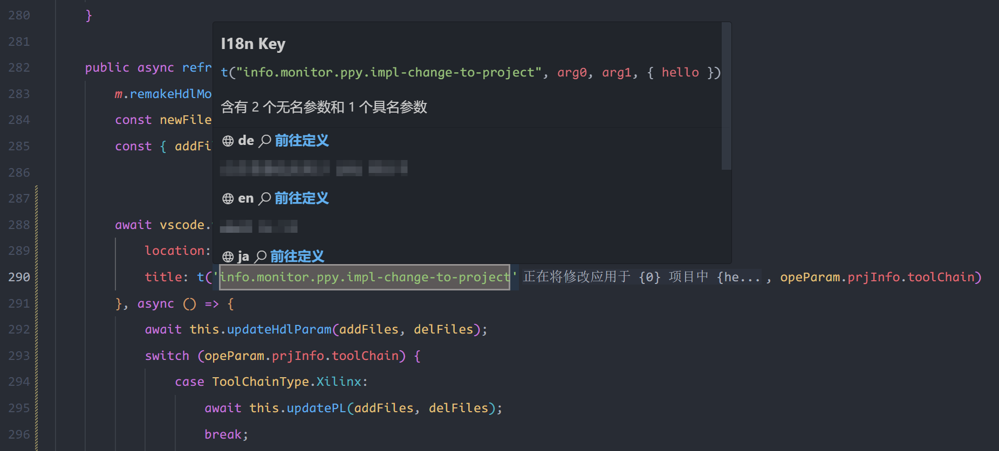

## i18n 组成的三部分

根据上文所提，一个基本的 i18n 支持由下面三部分组成。

:::info i18n支持的三部分
1. i18n 框架（包含 t函数，读入配置文件和切换自然语言的功能的开发语言的库）
2. i18n 配置文件（不同的自然语言的文本写在这里，可由不懂编程基础的专业翻译人员或者大模型进行迭代）
3. i18n 插件（用于弥补解耦合带来的开发上的难点）
:::

第三个是我提供的插件，因此在这篇文章，我简单谈谈前两个的一些规范和常识，希望没有从事过 i18n 软件开发的朋友可以好好学习。

## i18n 框架

### t 函数的函数签名

`i18n 框架` 通常由编程语言社区提供，常用的软件开发的编程语言，java, C++, rust, vue, swift, C# 清一色都有相当成熟的 i18n 库。

这些库基本都叫 xxx-i18n，比如 vue 的就叫 `vue-i18n`，我在过去也写过教程：

<detail-url
    href="https://kirigaya.cn/blog/article?seq=170"
    logo="kirigaya"
    title="vue-i18n 为 vue 项目添加多国语言"
    desc="在开发任何软件时，我们总希望这个软件的使用群体可以是任何人。"
></detail-url>

这些库一般在内部使用都会暴露一个 t 函数（translate的简称），用于进行翻译，这些函数几乎都有着如下的函数签名：

:::: code-group
::: code-group-item Rust
```rust
fn t(message: String) -> String;
```
:::
::: code-group-item Typescript
```typescript
function t(message: string): string;
```
:::
::: code-group-item C++
```cpp
std::string t(std::string message);
```
:::
::: code-group-item Java
```java
String t(String message);
```
:::
::::

比如我现在有如下的 i18n 配置文件

:::: code-group
::: code-group-item i18n/en.json
```json
{
    "i18n.introduction": "this is a tutorial about i18n-Haru"
}
```
:::
::: code-group-item i18n/zh-cn.json
```json
{
    "i18n.introduction": "这是一个有关 i18n-Haru 的教程"
}
```
:::
::::

那么当我们调用 `t("i18n.introduction")` 时，如果当前环境是英文（en），那么输出的值应该就是 `"this is a tutorial about i18n-Haru"`；如果是简体中文（zh-cn），那么就应该是 `"这是一个有关 i18n-Haru 的教程"`；如果输入 `t("balalbala")`，因为 "balalbala" 不在配置文件中，此时规定返回 "balalbala" 自己；如果当前选择的语言是 日语（ja），因为没有 `i18n/ja.json`，所以此时应该返回配置的默认语言。大部分 i18n 框架会选择 en 作为默认语言。

### 无名参数和具名参数

对于大部分的 i18n 框架，message 除了可以是普通字符串，也可以填充替位符。

i18n message 可以支持无名参数

```json
{
    "nice-dinner": "今天我们去了 {0} 吃了 {1} 这道菜，味道好极了"
}
```

可以这么调用：

```rust
let message = t("nice-dinner", name, meal_name);
```

假设 `name` 是拳击猫，`meal_name` 是菠萝披萨，那么上述 `message` 的输出值就是

```
今天我们去了 拳击猫 吃了 菠萝披萨 这道菜，味道好极了
```

i18n message 也可以支持无名参数

```json
{
    "nice-dinner": "今天我们去了 {name} 吃了 {meal_name} 这道菜，味道好极了"
}
```

可以这么调用：

```rust
let message = t("nice-dinner", { name, meal_name });
```

假设 `name` 是拳击猫，`meal_name` 是菠萝披萨，那么上述 `message` 的输出值就是

```
今天我们去了 拳击猫 吃了 菠萝披萨 这道菜，味道好极了
```

i18n haru 也进行了支持，会对上面格式的无名/具名参数进行提示。



## i18n 配置文件

### i18n 基本格式

i18n 配置文件 指存放真实翻译内容的文件，为了解耦合，一般是 json 或者 yaml 这样的标记语言组织的。

每一个 i18n 配置文件都需要把它对应的语言的 ISO 639 编码写在文件名字里面。

:::info
不了解 ISO 639 代码的朋友，可以看下面的文章
<detail-url
    href="https://kirigaya.cn/blog/article?seq=68"
    title="自然语言的ID——ISO 639语言编码标准"
    logo="kirigaya"
    desc="ISO 639 是用来分类语言的标准命名法（术语）"
></detail-url>
:::

文件的内容一般按照下面的格式进行组织：

:::: code-group
::: code-group-item bundle.en.json
```json
{
    "hello": "hello"
}
```
:::
::: code-group-item bundle.zh-cn.json
```json
{
    "hello": "你好"
}
```
:::
::::

其中， json 键值中的 key，比如上面左侧的 "hello" 被我们称为 translation key 或者 message key。在不引起歧义的情况下，我在下文用 message key 或者 message 来代指它。而右侧的则是 translation content 或者 message content。在不引起歧义的情况下，我在下文用 message content 或者 content 来代指它。


### i18n message key 命名规范

message key 一般都有命名规范，这是为了后续维护方便，并且可以减少对应的 key，让软件运行更加流畅。下面我原文分享一段我为团队编写的 i18n message key 命名规范。

:::info 锦恢的i18n命名规范
命名规则：

```html
<level>.<module>.<name>
```

比如 `info.monitor.update-pl`

- info: 通知等级
- monitor: 功能模块，此处是监视器
- name: 对于模块功能的描述，可以是更加复杂的层级关系，比如 name.subname.subsubname

上述的一个描述代表了一个如此的功能描述：

该功能描述了 monitor 这个功能模块的一个名叫 update-pl 的功能，该功能在进行输出时，输出等级为 info.

有的时候一个功能下可能希望更加细粒度的描述，比如说上面的 update-pl，这个功能的描述文本可以作为最终的主体文本（text），也可以作为最终描述该功能组件的标题（title），也可以是该功能的一个按钮（button）。总之，有的时候我们还希望指定该功能描述的一个实体/组件。所以下面的格式也是符合要求的：

```html
<level>.<module>.<name>.<component>
```

比如以下的三组描述：

```json
{
    "info.vcd-view.load.button": "加载",
    "info.vcd-view.load.title": "加载",
    "info.vcd-view.load.text": "正在加载 ..."
}
```

它们都代表了 `vcd-view` 这个功能模块的名为 `load` 的功能的中文翻译，但是这三个文本分别描述了实施这个 load 功能的功能组件：

- `info.vcd-view.load.button` 描述了 button 位置上需要渲染的文本
- `info.vcd-view.load.title` 描述了 title 位置上需要渲染的文本
- `info.vcd-view.load.text` 描述了 text 位置上需要渲染的文本

关于如何进行规定 `<component>` 位置上的值，应该由产品经理来规定。
:::