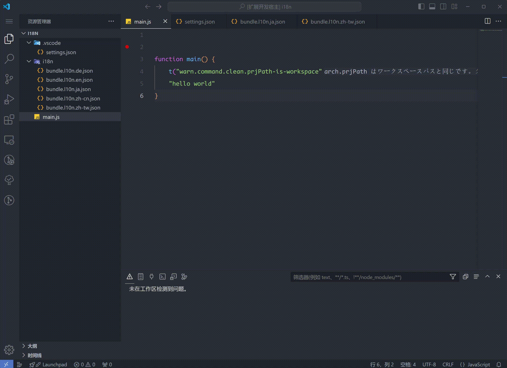

i18n Haru 提供了一些简单的 message key 管理功能

## 快速修复

快速修复功能可以让你快速添加所有缺失的 i18n message key，并去除多余的 message key.

## 快速创建 i18n token

通过选中编辑器中的文本，来快速创建一个新的 i18n token 项（快捷键 alt i）

## 快速删除 i18n token

如果在 json 文件中，可以通过点击右上角的 i18n 删除按钮同时在所有的 i18n 文件中删除某个 token：

