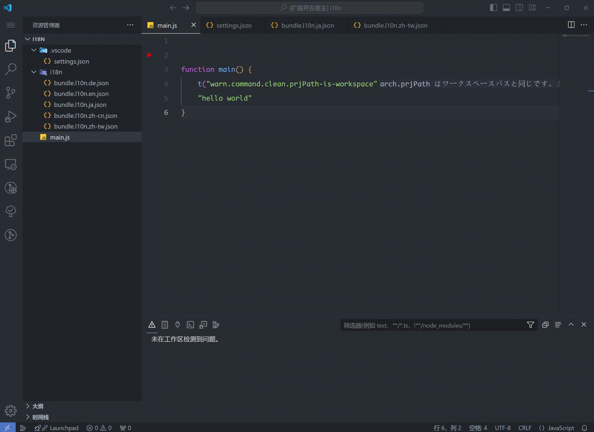

i18n Haru 的核心操作在于原文替换，假设你现在开发一个功能需要使用一段支持对语言的文本：

```python
widget.set_text("hello world")
```

你希望 hello world 未来可以支持 i18n，那么此时，使用光标框选住 hello world, 然后按下 alt i（或者鼠标右击选择“新增 i18n token”），此时 vscode 上方会出现一个文本输入框，输入你设置的 i18n message key 后回车， i18n Haru 就会把 `"<你设置的 i18n message key>": "<你框选的文本>"` 添加到每一个 i18n 配置文件末尾。如下演示。

