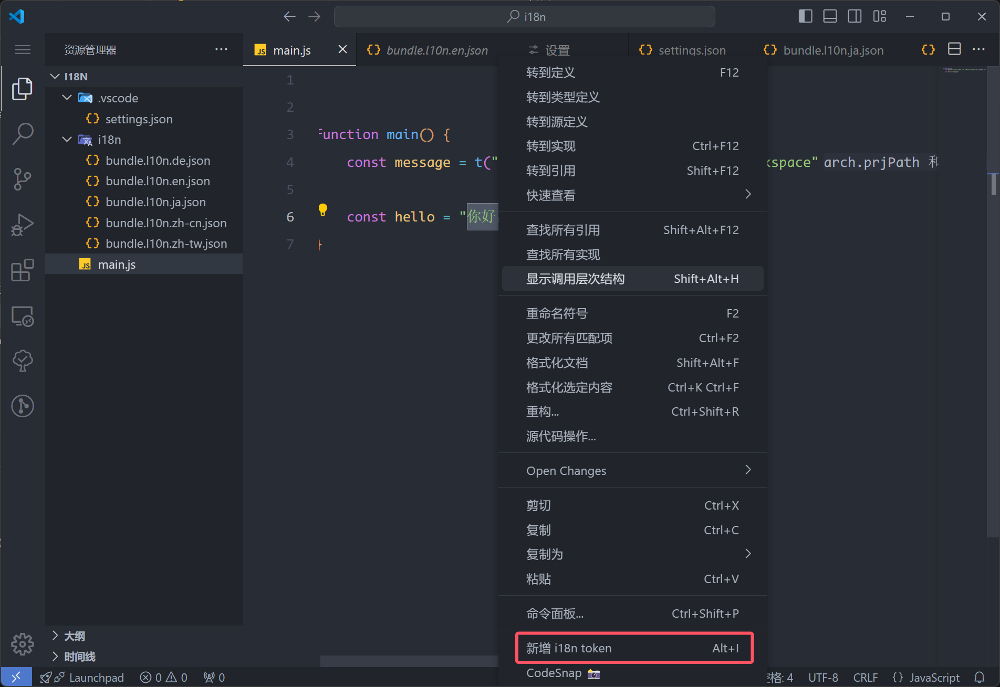
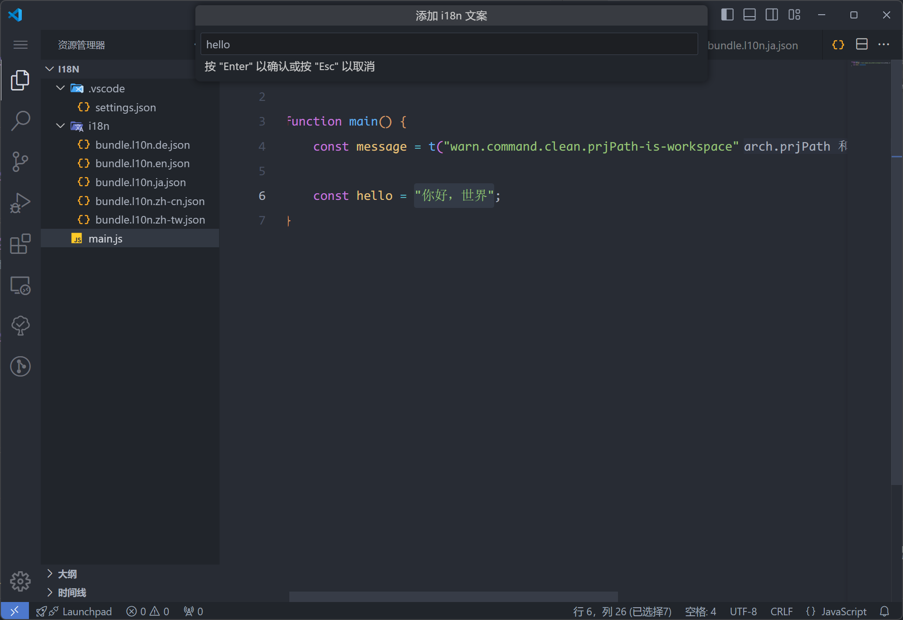
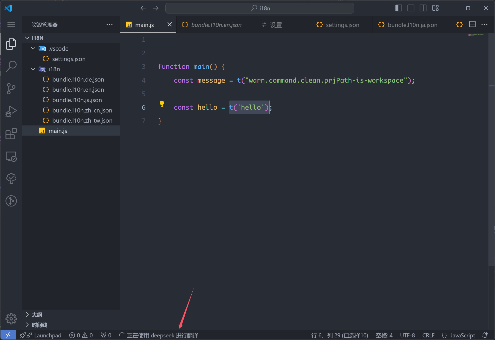
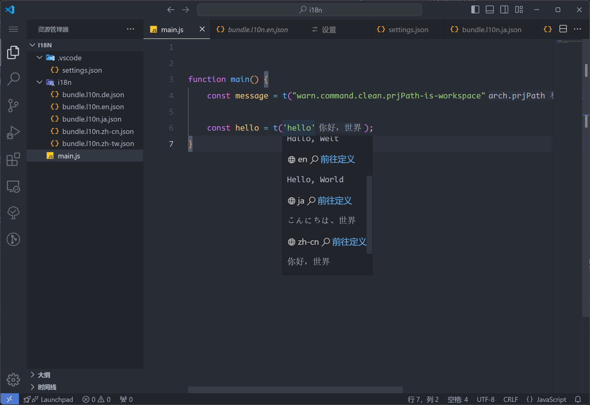

## 通过大模型完成翻译

为了更加便捷地进行翻译，我提供了接入大模型进行翻译的方式，你需要做的只有【选择大模型】->【填入 API】，就能快速享受大模型时代的便利。目前我只支持如下三个大模型，信息如下：

|公司|大模型|API 文档|
|:---|:---|:---|
|openai|gpt-4o-mini|[api-reference](https://platform.openai.com/docs/api-reference/)|
|deepseek|deepseek-chat|[首次调用 API](https://api-docs.deepseek.com/zh-cn/)|
|kimi|moonshot-v1-8k|[开始使用 Kimi API](https://platform.moonshot.cn/docs/guide/start-using-kimi-api)|

想要在 i18n Haru 中通过大模型进行自动化翻译，先在设置界面搜索 【翻译器】，找到下面这个配置项：


选择你需要的大模型后，再搜索 api key，配置一下 i18n Haru 翻译器的大模型对应的 api key（API KEY 的获取可以点击上方表格中【API 文档】前往获取）


配置完成后，此时再进行 [添加 i18n token](https://document.kirigaya.cn/docs/i18n-haru/usage.manage.html#%E5%BF%AB%E9%80%9F%E5%88%9B%E5%BB%BA-i18n-token) 的操作时，后台会自动完成添加的这一条 i18n message 的翻译并将结果汇总写入各个 i18n 配置文件中，翻译过程中的状态会反应在 vscode 的状态栏上。具体步骤和效果如下：

添加 i18n key



填入 message key



此时，原本的文本会被 t 函数调用取代，并且下方的状态栏上会出现“使用【翻译器名字】翻译”的字样，代表当前正在请求并翻译。此时你可以继续打代码，不需要操心上面文本的翻译事项。




等到翻译好后（这与你的网络状态、大模型提供商和翻译文本的长度有关），上方会自动出现翻译好的结果：



## 使用的翻译 prompt

为了不引起用户的顾虑，我将我采用的询问大模型的 prompt 放在这里，以供参考，如果有更好的 prompt，欢迎提 PR 或者 issue：

```typescript
export const translatePrompt = 'Please translate the value part of the following i18n message into languages corresponding to the language codes {0}, and return them as JSON strings mapped to their respective language codes. Do not include any markdown code blocks or any additional characters:';
```


## 通过网页版本大模型翻译的小工具

考虑到一部分用户可能是学生，并不想要为翻译工作支付额外成本，那么阁下可以考虑使用下面的流程来基于大模型的网页窗口来完成翻译工作。插件提供了两个小按钮让这个过程更加优雅简单。

我们注意到，需要翻译的文本往往排在 i18n 配置文件的结尾，所以采用如下的流程会翻译过程最快。比如对于一个项目，基准语言是简体中文，现在想要支持日文，但是日文的一部分没有翻译好，还是中英混杂，那么就可以如此操作：

<video controls width="100%">
  <source src="/i18n-haru/videos/translate.mp4" type="video/mp4">
  您的浏览器不支持 video 标签。
</video>

> 上方视频如果没有出现请尝试刷新本页
