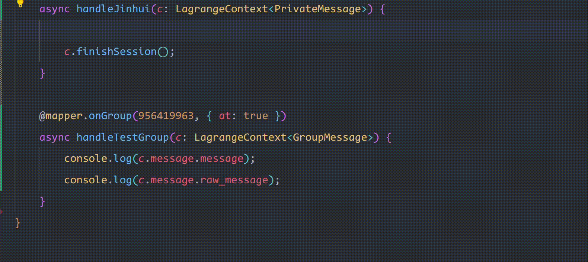

在之前的演示中，我们通过 `c.sendPrivateMsg` 发送了私聊的文本。但是很多时候我们希望发送富文本，比如图片，音频什么的。

框架支持两种类型的消息：
- [字符串](https://github.com/botuniverse/onebot-11/blob/master/message/string.md)
- [数组](https://github.com/botuniverse/onebot-11/blob/master/message/array.md)

<detail-url
    href="https://github.com/botuniverse/onebot-11/blob/master/message/string.md"
    logo="github"
    title="onebot-11 - message - 字符串"
></detail-url>


<detail-url
    href="https://github.com/botuniverse/onebot-11/blob/master/message/array.md"
    logo="github"
    title="onebot-11 - message - 数组"
></detail-url>


在 onebot 协议中，给出了明确的定义，点击上面的【字符串】和【数组】的链接就能看到。

## 字符串 string

对于字符串消息，直接发送即可：

```typescript
async handleJinhui(c: LagrangeContext<PrivateMessage>) {
    c.sendMessage('hello world');
}
```

QQ 原生使用一种称为 CKYU 的文本格式用于转义富文本：

```typescript
async handleJinhui(c: LagrangeContext<PrivateMessage>) {
    c.sendMessage('[CQ:face,id=178] 看看我刚拍的照片');
}
```

上述的文本在 QQ 中渲染出的效果就是一个 Emoji表情 + 一段文本。但是这种格式使用起来不是很优雅，以内不同类型的多媒体，对于 CQ code 的格式要求不一样，一旦格式出错，拉格朗日后端就会拒绝发送当前的消息，增加用户的开发难度。存在富文本的情况下，推荐使用下面的数组，因为有类型检查和自动补全。

## 数组 Send.Default[]

数组模式是 onebot 协议中支持的一种富文本消息表示形式，比如对于上文的 `[CQ:face,id=178] 看看我刚拍的照片`，可以认为它是 表情数据 + 文本数据 的一个数组，使用数组表示就是：

```typescript
[
    {
        type: 'face',
        data: {
            id: '178'
        }
    },
    {
        type: 'text',
        data: {
            text: ' 看看我刚拍的照片'
        }
    }
]
```

我们注入阁下的事务函数的那个上下文变量 `c` 中，有如下的对应关系：

- `c.message.message`： 就是消息的数组表示
- `c.message.raw_message`： 就是消息的纯文本表示

## 没有函数？无所谓！ typescript 的类型推导器会出手！

实际开发中，我们给所有发送消息的 API 接口声明为 ：

```typescript
message: string | Send.Default[]
```

`string` 就代表纯字符串，而 `Send.Default` 是所有 QQ 支持的富文本数据格式的类型合取。由于不同的数据格式的 `type` 字段都不一样，所以在真实开发中，当阁下指定了 `type` 的字面量后，`data` 字段就能自动补全了，在 vscode 中如下图所示：



因此，阁下完全不需要去记住这些接口类型， TS 的类型推导和自动补全能帮你做到这些。